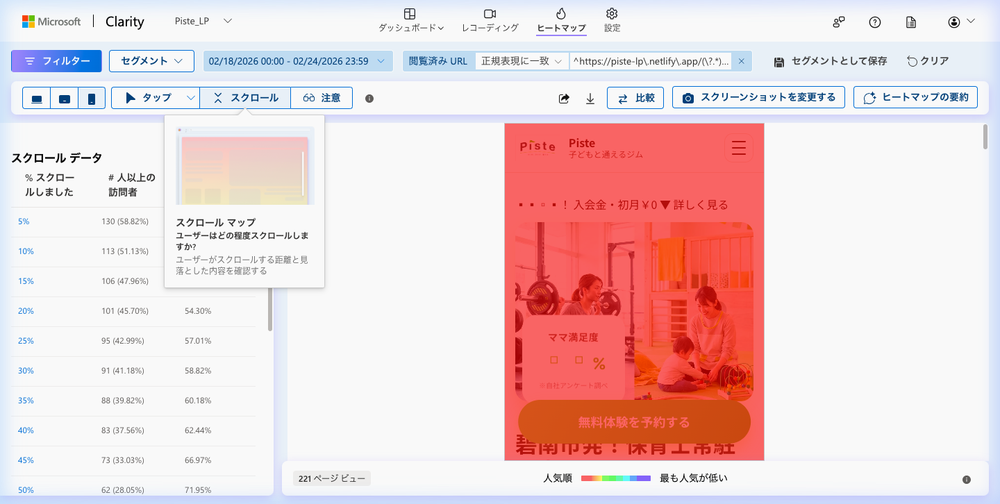
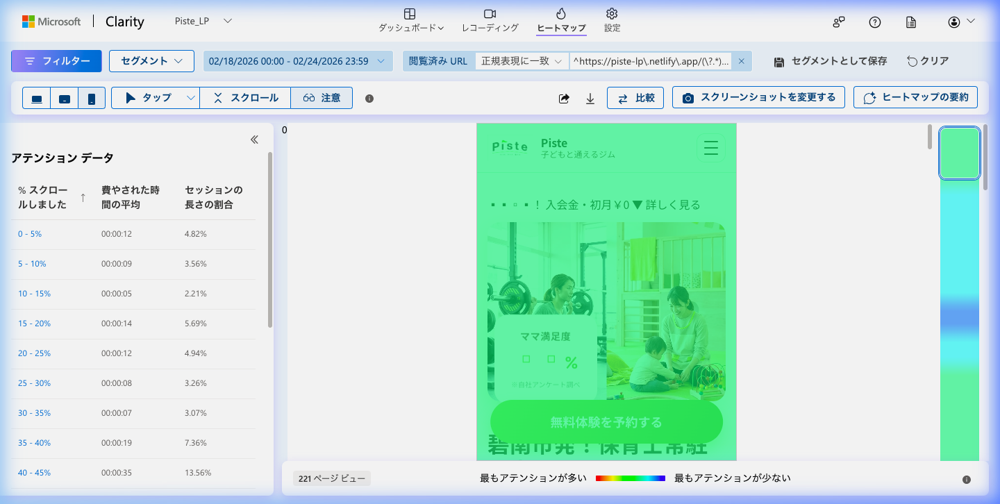
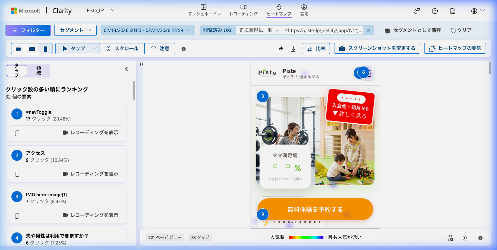
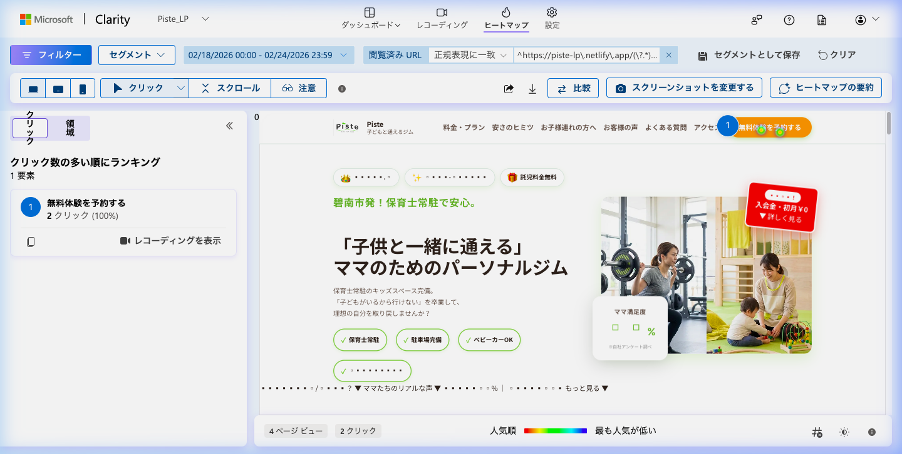

# piste_lp Clarityデータ — 2026-02-25

## 分析期間
2026-02-18 〜 2026-02-24

## 基本指標
- セッション数: 220
- ページビュー数: 231
- 平均滞在時間: 44秒
- 直帰率: 0.91% (Quick backs: 2セッション)
- デバイス比率（モバイル/デスクトップ）: モバイル 95.91% / デスクトップ 3.64%

## スクロールヒートマップ
- 25%到達率: 42.99%
- 50%到達率: 28.05%
- 75%到達率: 19.91%
- 100%到達率: 6.79%
- 主要離脱ポイント: 25%から50%の間で大幅な減少
- スクリーンショット: 

## アテンションヒートマップ
- 最も注目されているセクション: スクロール量 40-45% のセクション（滞在時間の 13.56% を占める）
- 注目度が低いセクション: スクロール量 10-15% のセクション
- スクリーンショット: 

## クリックヒートマップ
### モバイル
- 最もクリックされている要素: `#navToggle` (メニューボタン) - 17クリック (20.48%)
- デッドクリック: 全体の 6.36% (14セッション) で発生
- スクリーンショット: 

### デスクトップ
- 最もクリックされている要素: 「無料体験を予約する」ボタン - 2クリック
- デッドクリック: 特筆すべきデッドクリックなし
- スクリーンショット: 

## セッション録画の知見
### セッション1
- デバイス: モバイル (Instagram App)
- 滞在時間: 10分47秒（実稼働は短時間）
- 行動パターン: Instagram広告経由。複数回にわたり数秒〜数十秒ずつ閲覧。スクロールは見られず。
- 離脱ポイント: ヘッダー・メインビジュアル付近

### セッション2
- デバイス: モバイル (Instagram App)
- 滞在時間: 25秒
- 行動パターン: Instagram広告経由。読み込み後、操作なく静止したまま離脱。
- 離脱ポイント: ヘッダー・メインビジュアル付近

### セッション3
- デバイス: モバイル (Safari)
- 滞在時間: 6秒
- 行動パターン: ページ読み込み後、即座に離脱。
- 離脱ポイント: ヘッダー・メインビジュアル付近
