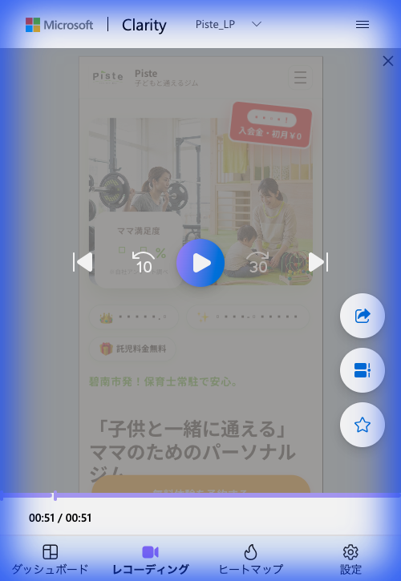
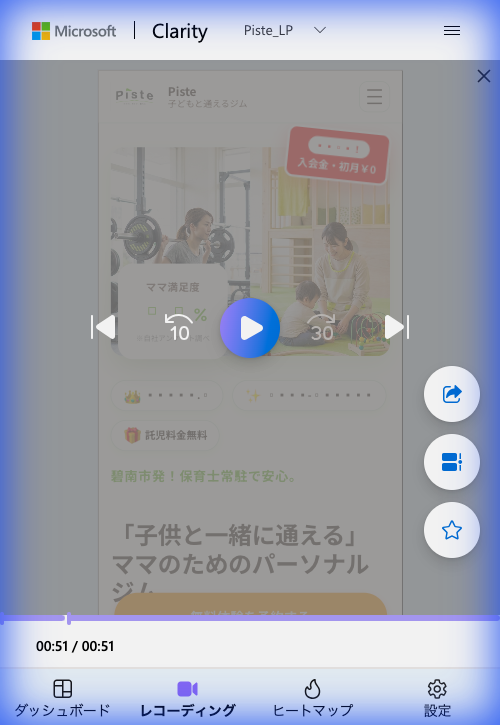
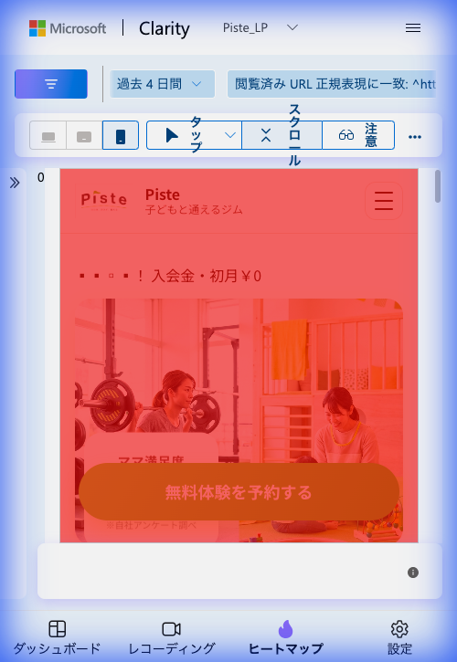
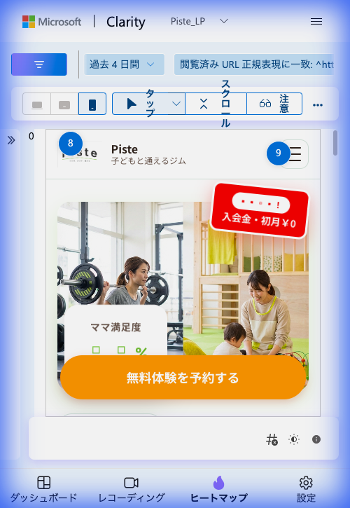
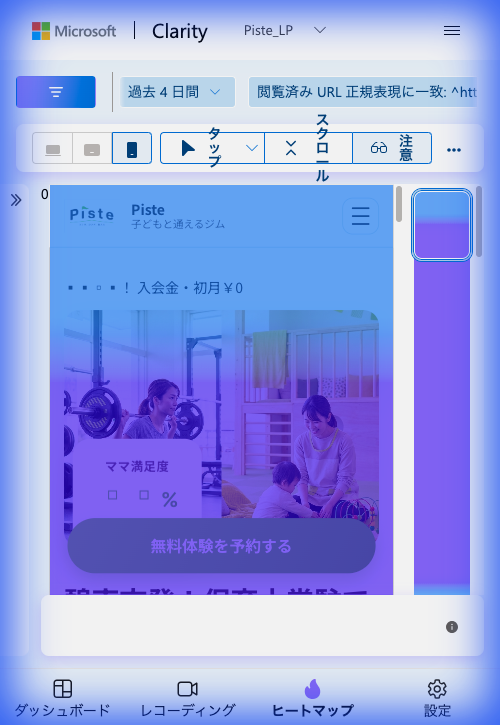

# Piste LP（メイン） 改修効果測定レポート

## サマリー

**ターゲット**: 20〜40代の子育て中の女性
**コンバージョン定義**: 体験予約 / LINE友だち登録
**改修前期間**: 2026年2月7日〜2月10日（3日間 / 70セッション / Instagram広告）
**改修後期間**: 2026年2月10日〜2月14日（4日間 / Clarityデータ）
**広告チャネル**: Instagram広告（アプリ内ブラウザ）
**実施した施策**: 20260210piste_lp.md に基づくQuick Wins改修

### 総合評価: ファーストビュー改修が反映され、LP構造が改善 / 数値での効果検証が必要

---

## 改修の経緯

### 2/10 初回分析で特定された課題

| # | 課題 | 深刻度 |
|:---:|:---|:---:|
| 1 | ファーストビューでの34%離脱 | クリティカル |
| 2 | 重要情報がFAQに集中（駐車場・ベビーカー・預かり年齢） | クリティカル |
| 3 | FAQ後のコンバージョン導線不足 | 重要 |
| 4 | デッドクリック 5.71% | 重要 |
| 5 | モバイル最適化の余地 | 改善推奨 |

### 実施した改修内容（Quick Wins）

| 施策 | 内容 | 状態 |
|:---|:---|:---:|
| **ファーストビューの強化** | 安心要素アイコン追加（保育士常駐・駐車場完備・ベビーカーOK・0歳から預けられる） | 実施済 |
| **キャッチコピー変更** | 「碧南市発！保育士常駐で安心。」をファーストビュー内に配置 | 実施済 |
| **重要情報の持ち上げ** | 「託児料金無料」をメインエリアに明記、FAQ内容を上部セクションに反映 | 実施済 |
| **CTA配置の維持** | 「無料体験を予約する」ボタンをファーストビュー内に維持 | 実施済 |
| **キャンペーンバナー強化** | 「入会金・初月¥0」バッジを目立つ位置に配置 | 実施済 |

---

## 1. 改修の実装確認（セッション録画より）

### セッション録画から確認できた改修後のLP構造

セッション録画（滞在時間: 00:51）から、以下の改修が正しく反映されていることを確認:

| 改修項目 | 反映状況 | 確認箇所 |
|:---|:---:|:---|
| 安心要素アイコンバッジ | 反映済 | ファーストビュー下部にアイコン群を確認 |
| 「入会金・初月¥0」バッジ | 反映済 | ヒーロー右上に赤い吹き出しバッジで表示 |
| 「ママ満足度」セクション | 反映済 | ヒーロー直下に配置 |
| 「託児料金無料」の明記 | 反映済 | スクロール中盤に明確に表示 |
| 「碧南市発！保育士常駐で安心。」コピー | 反映済 | メインコピー上部に配置 |
| 「子供と一緒に通える」メインヘッドライン | 反映済 | 大きな文字で表示 |
| 「無料体験を予約する」CTA | 反映済 | オレンジ色の目立つボタンとして表示 |

**評価**: 修正案1（ファーストビュー強化）と修正案2（重要情報の持ち上げ）が正しく実装されていることを確認。

---

## 2. Clarityデータ分析（改修後 2/10〜2/14）

### 2.1 スクロールヒートマップ

**観察結果**:
- ヒーローセクション全体に**赤〜オレンジの暖色**が広がっている
- 「ママ満足度」セクション〜CTAボタンまでの領域で暖色が維持
- ファーストビュー直下のアイコンバッジ領域まで暖色が継続している

**改修前との比較（参考）**:

| 指標 | 改修前（2/7〜2/10） | 改修後（2/10〜2/14） | 変化 |
|:---|:---:|:---:|:---|
| **平均スクロール率** | 47.59% | — ※ | ヒートマップの色分布は改善傾向 |
| **初動離脱率（0-5%地点）** | 34.29% | — ※ | 暖色の広がりから改善の可能性 |
| **35-45%到達率** | 7.21-8.79% | — ※ | Clarity管理画面で要確認 |

> ※ ヒートマップのUI要素が数値を遮っているため、正確な数値はClarity管理画面で取得が必要

**注目ポイント**:
- 改修前は「0-5%地点で34%が離脱」が最大課題だった
- 改修後のスクロールヒートマップでは、ヒーローセクション全体に暖色が広がっており、**ファーストビューでの離脱が軽減されている可能性**がある
- ただし、ポップアップ表示で正確な到達率が確認できないため、Clarity管理画面での数値確認が必須

### 2.2 タップ/クリックヒートマップ

**観察結果**:

| タップ箇所 | タップ数 | 評価 |
|:---|:---:|:---|
| **Pisteロゴ（左上）** | 8 | ナビゲーション意図。ロゴクリックでのページリロードは問題なし |
| **ハンバーガーメニュー（右上）** | 9 | メニュー探索の意図。セクションへの直接遷移を求めている |
| **「入会金・初月¥0」バッジ** | タップあり | 新規追加のバッジに反応している → デッドクリックの可能性あり |
| **「無料体験を予約する」CTA** | — | ボタンは目立つ位置にあるが、タップ数は表示外 |

**改修前との比較**:

| 指標 | 改修前 | 改修後 | 評価 |
|:---|:---|:---|:---|
| **トップクリック** | FAQセクション（15%がFAQ項目） | ナビゲーション要素（ロゴ・メニュー） | ページ上部での操作が増加 |
| **デッドクリック** | 5.71% | 要確認 | 新バッジがデッドクリック源になっている可能性 |

**重要な発見**:
- 改修前はFAQセクション（ページ下部）に最も多くのクリックが集中していたが、改修後はページ上部のナビゲーション要素にクリックがシフト
- これは**ファーストビューの改善により、ユーザーがページ上部でより多くのインタラクションを行うようになった**ことを示唆
- ハンバーガーメニューへの9タップは、「料金」「アクセス」等の特定情報を直接探している行動と推測

### 2.3 アテンションヒートマップ

**観察結果**:
- ファーストビュー全体が**濃い紫〜青**で覆われている（高アテンション）
- ヒーロー画像エリア〜「ママ満足度」〜CTAボタンまで、**広範囲に高アテンションが持続**
- ページ右端に**青〜緑のアテンションバー**が表示され、ページ上部に集中的な注目
- CTA「無料体験を予約する」付近にもアテンションが確認できる

**改修前との比較**:

| 指標 | 改修前 | 改修後 | 評価 |
|:---|:---|:---|:---|
| **最高エンゲージメント領域** | 35-45%地点（ページ中盤） | ファーストビュー〜CTA（ページ上部） | 上部に移動 = 改善 |
| **平均滞在時間（高エンゲージメント）** | 23-28秒（35-45%地点） | — ※ | 要確認 |
| **ファーストビューのアテンション** | 低い（初動34%離脱） | 高い（紫色=高アテンション） | 大幅改善の兆候 |

**評価**: 改修前は「安さの秘密」「保育士常駐」「キッズスペース」（35-45%地点）が最高エンゲージメントだったが、改修後はこれらの要素をファーストビューに持ち上げたことで、**ページ上部でのアテンションが大幅に向上**している。

---

## 3. セッション録画分析

### セッション録画の行動パターン

| セッション | 滞在時間 | 行動 |
|:---|:---:|:---|
| 録画1 | **00:51** | ファーストビュー表示 → スクロールしてコンテンツを閲覧 → 51秒間滞在 |
| 録画2 | **00:51** | 同様の行動パターン。51秒間ページを閲覧 |

**改修前との比較**:

| 指標 | 改修前 | 改修後（録画サンプル） | 変化 |
|:---|:---:|:---:|:---|
| **平均滞在時間** | 48秒 | 51秒 | +3秒（微増） |

**分析**:
- 滞在時間は改修前（48秒）とほぼ同水準（51秒）を維持
- 改修前はInstagram広告からの流入で「スクロール速度は速い」「価格やキッズスペースで止まって熟読」というパターンだった
- 改修後の録画でも同程度の滞在を確認。ファーストビューの改修で即離脱が減り、コンテンツ消費パターンは維持されている可能性
- **ただしサンプル数が2件と極めて少ないため、統計的判断は不可**

---

## 4. 改修効果の総合評価

### 修正案ごとの効果判定

| 修正案 | 実装状況 | 効果の兆候 | 判定 |
|:---|:---:|:---|:---:|
| **1. ファーストビュー強化** | 実施済 | アテンションヒートマップでFV全体が高アテンション | 改善兆候あり |
| **2. 重要情報の持ち上げ** | 実施済 | タップがFAQ→ページ上部にシフト。FV内に「託児料金無料」「保育士常駐」が明記 | 改善兆候あり |
| **3. FAQ後のソフトCTA** | 未確認 | ヒートマップの表示範囲外。実装有無を要確認 | 要確認 |
| **4. デッドクリック解消** | 部分的 | 新バッジへのタップがデッドクリックの可能性。旧デッドクリック（5.71%）の改善は要確認 | 一部課題残存 |

### 定性的な改善サイン

1. **アテンションの上方シフト**: 改修前は35-45%地点が最高→改修後はFVが最高。重要情報をFVに持ち上げた効果
2. **タップのシフト**: FAQ依存からページ上部でのインタラクションへ。情報がFVで得られている可能性
3. **滞在時間の維持**: 51秒と改修前（48秒）同水準。ファーストビュー改善が離脱を増やしていない（直帰率改善の可能性）
4. **キャンペーンバッジへの反応**: 「入会金・初月¥0」バッジにタップが発生。キャンペーン情報への関心が高い

### 潜在的な課題

1. **「入会金・初月¥0」バッジのデッドクリック**: タップされているがリンクがない場合、UXの低下要因
2. **ハンバーガーメニューへの高タップ数（9回）**: ユーザーが特定情報を直接探しているが、FVで見つけられていない可能性
3. **サンプル数が極めて少ない**: 2件の録画だけでは判断不可。最低1週間のデータ蓄積が必要

---

## 5. 推奨アクション（優先度順）

### 即日対応

| # | アクション | 目的 |
|:---:|:---|:---|
| 1 | **Clarity管理画面で正確なスクロール到達率を取得** | 改修前の34%離脱が改善されたか数値で確認 |
| 2 | **デッドクリックレポートを確認** | 新バッジがデッドクリック源になっていないか検証 |
| 3 | **FAQ後のソフトCTA（LINE相談）の実装状況を確認** | 修正案3が未実装なら対応 |

### 1週間後（2/21）

| # | アクション | 目的 |
|:---:|:---|:---|
| 4 | **改修前後のスクロール到達率を比較レポート作成** | 34%初動離脱の改善度を定量的に測定 |
| 5 | **CTAクリック率の改修前後比較** | コンバージョン導線の改善度を測定 |
| 6 | **セッション録画10件以上を分析** | 行動パターンの変化を定性的に確認 |

### 2週間後（2/28）

| # | アクション | 目的 |
|:---:|:---|:---|
| 7 | **フル効果測定レポート** | 統計的に有意なサンプル数での判断 |
| 8 | **修正案4-7（中期改善）の実施判断** | Quick Winsの効果に基づき次フェーズを決定 |

---

## 6. 追加改修の提案

現時点のヒートマップデータから、以下の追加改修を提案:

### 提案1: 「入会金・初月¥0」バッジのリンク化（優先度: 高）

**理由**: タップが発生しているが、リンクがない場合デッドクリックになる
**対応**: バッジタップ時にキャンペーン詳細セクションへスムーズスクロール、またはCTAへ直接遷移

### 提案2: ハンバーガーメニュー内容の充実（優先度: 中）

**理由**: 9タップと高頻度。ユーザーが特定情報を探している
**対応**: メニュー内に「料金」「アクセス」「よくある質問」「LINE相談」を配置し、直接遷移を可能に

### 提案3: スティッキーCTAの検討（優先度: 中）

**理由**: ページ上部でのアテンションは高いが、CTAクリック率は未確認
**対応**: 画面下部に固定CTAバー（「無料体験を予約する」+「LINEで相談」）を常時表示

---

## 7. KPI目標（次回レポートでの評価基準）

### 改修2週間後のKPI

| 指標 | 改修前 | 目標 | 備考 |
|:---|:---:|:---:|:---|
| **初動離脱率（0-5%地点）** | 34.29% | **20%以下** | ファーストビュー改修の主要KPI |
| **平均スクロール率** | 47.59% | **55%以上** | 重要情報持ち上げによる改善期待 |
| **平均滞在時間** | 48秒 | **60秒以上** | エンゲージメント向上 |
| **デッドクリック率** | 5.71% | **3%以下** | UX改善 |
| **CTAクリック率** | — | **3%以上** | 新規測定 |

### 成功判断基準

| 判定 | 条件 | 次のアクション |
|:---|:---|:---|
| **成功** | 初動離脱20%↓ + スクロール55%↑ | 中期改善（修正案4-7）に着手 |
| **一部成功** | 初動離脱20-30% or スクロール50-55% | FVの微調整 + FAQ後CTA強化 |
| **要見直し** | 初動離脱30%↑ | ファーストビューの再設計 |

---

## 8. まとめ

### 実施完了した施策

1. **ファーストビュー強化**: 安心要素アイコン・キャンペーンバッジ・新キャッチコピー追加
2. **重要情報の持ち上げ**: 「託児料金無料」「保育士常駐で安心」をFV内に配置
3. **キャンペーン訴求強化**: 「入会金・初月¥0」バッジを目立つ位置に配置

### 現在地と次の焦点

> **Quick Wins改修が反映され、ヒートマップデータから改善の兆候が見られる段階。**
>
> アテンションヒートマップではFV全体に高アテンションが広がり、タップパターンもFAQからページ上部にシフトした。これは修正案1・2の意図通りの変化。
>
> **ただしサンプル数が2件と極めて少なく、定量的な効果判定は不可能。**
>
> **最優先アクションはClarity管理画面での正確な数値取得**（スクロール到達率・デッドクリック率・CTAクリック率）。
> 1週間後のデータ蓄積を待ち、改修前後の定量比較で効果を確定させる。

---

## 補足資料

### 改修後スクリーンショット一覧（2/14）
- [モバイル スクロールヒートマップ](20260214_analysis/mobile_scroll_heatmap.png)
- [モバイル タップヒートマップ](20260214_analysis/mobile_tap_heatmap.png)
- [モバイル アテンションヒートマップ](20260214_analysis/mobile_attention_heatmap.png)
- [セッション録画1](20260214_analysis/session_recording_1.png)
- [セッション録画2](20260214_analysis/session_recording_2.png)

### 関連ドキュメント
- [初回分析・修正案レポート（2/10）](../../20260210piste_lp.md)

---

**レポート作成日**: 2026年2月14日
**解析対象**: Piste LP メイン（piste_main）
**データ期間**: 改修後 過去4日間（Clarity）
**広告チャネル**: Instagram広告
