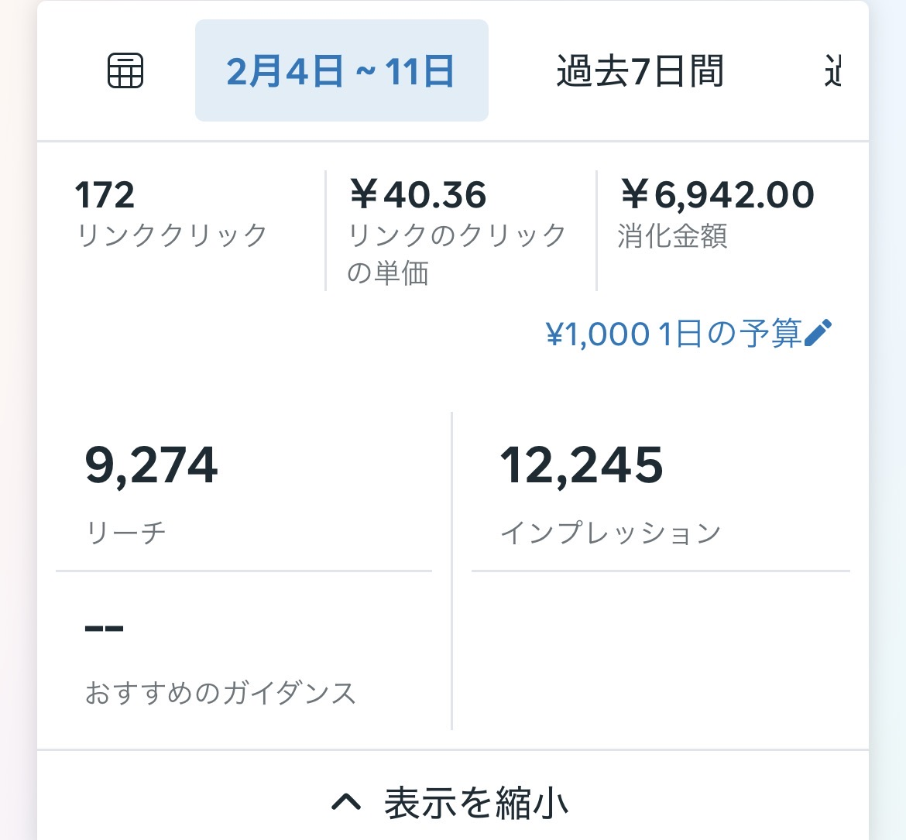
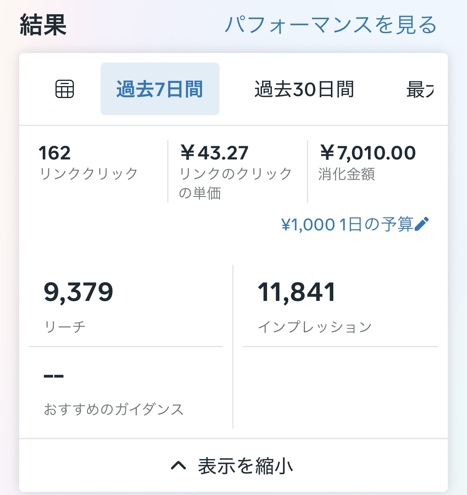
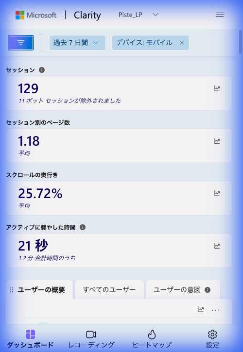
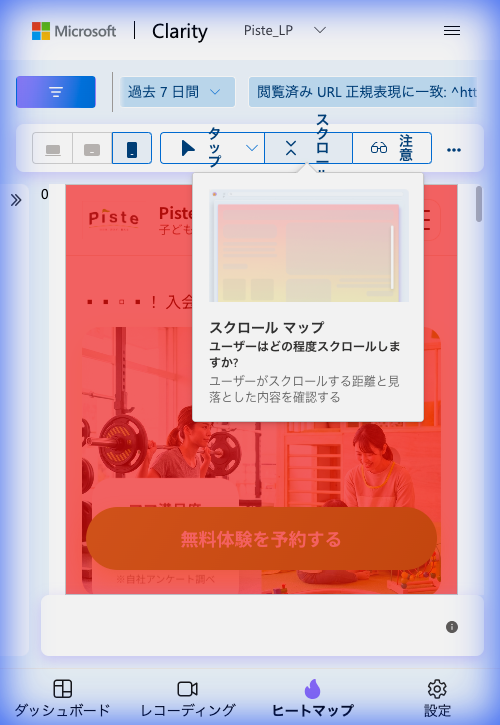
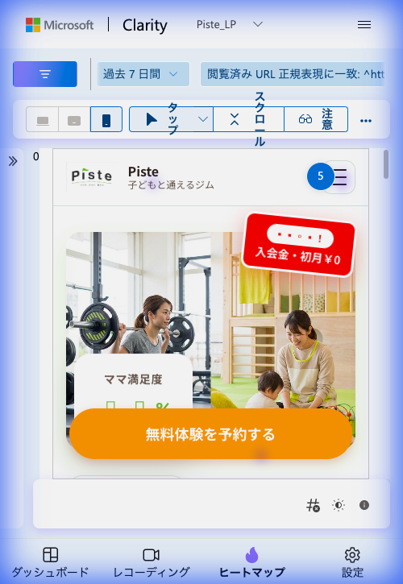
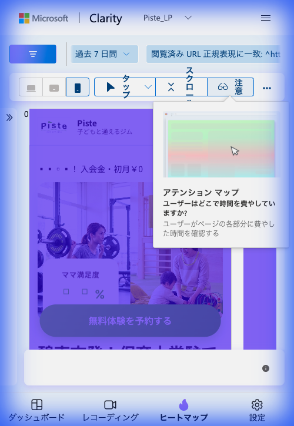
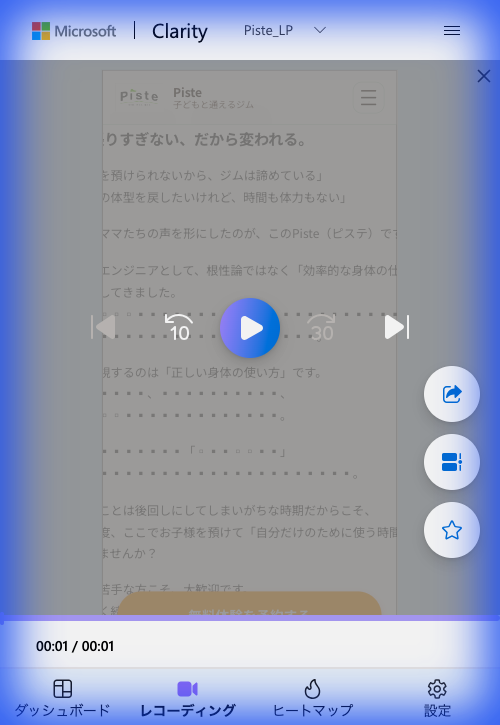
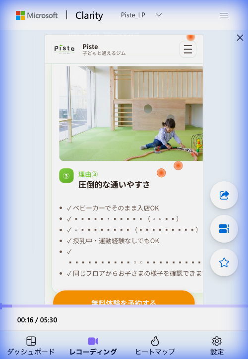

# Piste LP 1週間成果レポート（2026/02/18）

## サマリー

**ターゲット**: 20〜40代の子育て中の女性
**コンバージョン定義**: 体験予約 / LINE友だち登録
**改修実施日**: 2026年2月10日（Quick Wins実装）
**今回の計測期間**: 2026年2月11日〜2月18日（7日間 / モバイルのみ）
**広告チャネル**: Instagram広告（アプリ内ブラウザ）
**広告予算**: ¥1,000/日

### 総合評価: 要改善 — 広告効率は維持もLP内行動が悪化。スクロール深度が半減

---

## 1. Instagram広告パフォーマンス比較




| 指標 | 改修前（2/4-2/11） | 改修後（2/11-2/17） | 変化 | 評価 |
|:---|:---:|:---:|:---:|:---:|
| **リンククリック** | 172 | 162 | **-10（-5.8%）** | 微減 |
| **CPC（クリック単価）** | ¥40.36 | ¥43.27 | **+¥2.91（+7.2%）** | 上昇 |
| **消化金額** | ¥6,942 | ¥7,010 | +¥68（+1.0%） | ほぼ同額 |
| **リーチ** | 9,274 | 9,379 | +105（+1.1%） | ほぼ同数 |
| **インプレッション** | 12,245 | 11,841 | **-404（-3.3%）** | 微減 |
| **CTR（推定）** | 1.40% | 1.37% | -0.03pt | ほぼ横ばい |
| **フリークエンシー（推定）** | 1.32回 | 1.26回 | -0.06 | ほぼ同水準 |
| **日予算** | ¥1,000 | ¥1,000 | — | 変更なし |

### 広告データの分析

**広告パフォーマンスは安定**:
- リーチ・インプレッション・CTRはほぼ変わらず。広告自体の訴求力は維持されている
- CPCが¥40.36→¥43.27に7.2%上昇。同一クリエイティブの継続運用による**広告疲れの初期兆候**
- フリークエンシー（1人あたり表示回数）1.3回前後は健全な水準。ただし今後上昇すると急速に効率低下

### クリック→セッション変換率の悪化（重要）

| 指標 | 改修前 | 改修後 | 変化 |
|:---|:---:|:---:|:---:|
| 広告クリック数（7日間） | 172 | 162 | -10 |
| Clarityセッション数 | 約163 ※1 | 129（モバイル） | — |
| **クリック→セッション変換率** | **約95%** | **約79.6%** | **-15.4pt** |

> ※1 改修前は3日間で70セッション。7日換算で約163と推定（日平均23.3 × 7）

**162回クリックされたのに、Clarityで記録されたセッションは129件**。約20%のクリックがセッションとして記録されていない。

考えられる原因:
- Instagramアプリ内ブラウザでの**ページ読み込み遅延**（Clarity発火前に離脱）
- Clarityの「デバイス: モバイル」フィルターから漏れたセッション
- ボット除外（11件）に加え、実際のユーザーでも**ページ表示前のバックボタン**が発生

---

## 2. LP内行動 KPI比較（改修前 vs 1週間後）

| 指標 | 改修前（2/7-2/10） | 1週間後（2/11-2/18） | 変化 | KPI目標 | 判定 |
|:---|:---:|:---:|:---:|:---:|:---:|
| **Clarityセッション数** | 70（3日間） | 129（7日間） | 23.3/日 → 18.4/日 | — | 日次減少 |
| **ページ/セッション** | — | 1.18 | — | — | 新規計測 |
| **平均スクロール深度** | 47.59% | **25.72%** | **-21.87pt** | 55%以上 | 未達 |
| **アクティブ時間** | — | **21秒** | — | — | 新規計測 |
| **合計滞在時間** | 48秒 | **約72秒**（1.2分） | **+24秒** | 60秒以上 | 達成 |
| **初動離脱率（0-5%）** | 34.29% | — ※ | — | 20%以下 | 要確認 |
| **デッドクリック率** | 5.71% | — ※ | — | 3%以下 | 要確認 |

> ※ スクロールヒートマップのツールチップ表示により、初動離脱率の正確な数値が確認できず。デッドクリックレポートも未取得。

### 注意: 計測条件の差異

- **改修前**: 全デバイス合算の可能性あり
- **1週間後**: モバイルのみにフィルタリング済み
- **滞在時間**: 改修前は「平均滞在時間」、改修後は「合計時間1.2分 / アクティブ時間21秒」と内訳が判明
- **セッション数差異**: 広告クリック162に対しClarityセッション129。約20%がセッション未記録

---

## 2. Clarityデータ詳細分析

### 2.1 ダッシュボード概要



**確認できた数値**:

| 指標 | 値 | 分析 |
|:---|:---:|:---|
| セッション数 | 129 | 11ボットセッション除外済。7日間で129 = 日平均18.4セッション |
| ページ/セッション | 1.18 | ほぼ1ページのみ閲覧。LP特性として正常 |
| スクロールの奥行き | 25.72% | **ページの1/4しかスクロールされていない。深刻な課題** |
| アクティブ時間 | 21秒 | 合計1.2分中の21秒。残りはアイドル状態 |

**スクロール深度25.72%の意味**:
- ページ全体の約1/4地点 = ヒーローセクション〜「ママ満足度」セクションまでで大半が離脱
- 「選ばれる3つの理由」セクション（ページ30-50%地点）に到達していないユーザーが多い
- 価格比較・お客様の声・FAQ・CTAがほとんど閲覧されていない

### 2.2 スクロールヒートマップ



**観察結果**:
- ファーストビュー（ヒーロー〜CTAボタン）は暖色（赤〜オレンジ）で到達率が高い
- CTAボタン「無料体験を予約する」付近まではユーザーが到達している
- **CTAボタン以降で急速に色が薄くなる** → ファーストビュー通過後に大量離脱
- ツールチップが表示されており各地点の正確な到達率は読み取れないが、全体的に**上部集中・下部過疎**の傾向が顕著

**改修前との比較**:
- 改修前（2/10）: 0-5%で34%離脱、35-45%が最もエンゲージメントが高い
- 改修後（2/18）: ファーストビューのアテンションは改善したが、その先への遷移が大幅減少
- **ファーストビューで情報が完結してしまい、スクロールの動機が失われている可能性**

### 2.3 タップ/クリックヒートマップ



**観察結果**:

| タップ箇所 | タップ数 | 評価 |
|:---|:---:|:---|
| ハンバーガーメニュー（右上） | **5** | 改修前9 → 減少（改善兆候） |
| 「入会金・初月¥0」バッジ | タップあり | 引き続きデッドクリックの可能性 |
| CTAボタン「無料体験を予約する」 | 表示外 | CTA周辺にタップが見られるが正確な数値は不明 |

**改修前との比較**:

| 指標 | 改修前（2/10） | 2/14中間 | 2/18現在 | 傾向 |
|:---|:---|:---|:---|:---|
| トップクリック箇所 | FAQ（15%） | ナビ（ロゴ8・メニュー9） | ナビ（メニュー5） | FAQ依存は解消 |
| ハンバーガーメニュー | — | 9タップ | 5タップ | 減少 = FVで情報が充足 |
| デッドクリック | 5.71% | 要確認 | 要確認 | — |

**分析**:
- ハンバーガーメニューのタップ減少（9→5）は、ファーストビューの情報充実により「他を探す必要」が減ったことを示唆
- ただし全体的にタップ数が少ない = **ユーザーがアクティブに操作せず離脱している**

### 2.4 アテンションヒートマップ



**観察結果**:
- ファーストビュー全体が**紫〜青色（高アテンション）**で覆われている
- ヒーロー画像→「ママ満足度」→CTAボタンまで高アテンションが持続
- 右側のアテンションバーでもページ上部に集中的な注目が確認できる
- ページ中盤以降はアテンションが急落

**改修前との比較**:

| 指標 | 改修前 | 2/14中間 | 2/18現在 |
|:---|:---|:---|:---|
| 最高エンゲージメント | 35-45%地点（23-28秒滞在） | FV全体 | FV全体 |
| FVアテンション | 低（34%即離脱） | 高（紫色） | **高（紫色維持）** |
| 中盤以降 | エンゲージメントあり | — | **急落** |

**重要な示唆**: ファーストビューの改修は**確実にアテンション向上に成功**している。しかしそのアテンションが**ページ下部への遷移に変換できていない**。

### 2.5 セッション録画分析

#### セッション録画1: 離脱パターン（1秒）



- **滞在時間**: 00:01（即離脱）
- **行動**: ページ中盤のテキストコンテンツ表示 → 即離脱
- **表示内容**: 「りすぎない、だから変われる。」「ママたちの声を形にしたのが、このPiste（ピステ）です」等のトレーナー紹介テキスト
- **推測**: 広告からの流入でページ中盤にランディングした可能性、またはクイックバック（期待と異なるコンテンツ）

#### セッション録画2: 高エンゲージメント（5分30秒）



- **滞在時間**: **05:30**（非常に高いエンゲージメント）
- **閲覧地点**: 「理由3: 圧倒的な通いやすさ」セクション
- **確認できた行動**:
  - キッズスペース画像を注意深く閲覧
  - 「ベビーカーでそのまま入店OK」等の通いやすさ情報を熟読
  - 「同じフロアからお子さまの様子を確認できます」に注目
  - 「無料体験を予約する」CTAボタンが画面下部に表示
  - オレンジのインタラクションドットが複数 → 積極的にページを操作

**2つのセッションから見える二極化**:
- **即離脱層**（1秒）: 広告との期待ミスマッチ or ターゲット外流入
- **高エンゲージメント層**（5分30秒）: LPの内容に強い関心を持ち、詳細を熟読

---

## 4. 問題の根本分析

### 仮説1: ファーストビューでの「情報完結」による逆効果（可能性: 高）

Quick Winsで実施した改修:
- 安心要素アイコン追加（保育士常駐・駐車場完備・ベビーカーOK・0歳から預けられる）
- キャッチコピー変更
- 重要情報のFV持ち上げ

**意図しない結果**: FVに情報を集約した結果、ユーザーがFVで「内容を把握した」と感じ、**スクロールする理由が失われた**可能性。

| 改修前 | 改修後 |
|:---|:---|
| FVの情報少ない → 「もっと知りたい」→ スクロール47.59% | FVの情報十分 → 「大体わかった」→ スクロール25.72% |
| FAQまで到達してクリック | FVで情報を得て離脱 |

### 仮説2: 広告疲れの初期兆候（可能性: 中 — 広告データで裏付けあり）

Instagram広告データが示す事実:
- **CPC上昇**: ¥40.36 → ¥43.27（+7.2%）— 同一クリエイティブ継続による効率低下
- **クリック数微減**: 172 → 162（-5.8%）— 予算消化ペースはほぼ同じだがクリック数が減少
- **インプレッション減少**: 12,245 → 11,841（-3.3%）— Instagramアルゴリズムの配信効率低下
- **リーチはほぼ同数**: 9,274 → 9,379 — 新規ユーザーへの到達は維持
- **フリークエンシー**: 約1.3回で健全水準。ただし今後2.0を超えると急速に劣化

**判断**: 広告疲れは**初期段階**。現時点ではCTR（1.4%→1.37%）に大きな影響はないが、CPCの上昇傾向は要注意。2週間以上同一クリエイティブを継続すると急速に悪化するリスクあり。

### 仮説3: ページ読み込み問題（可能性: 中〜高 — 新たに発見）

広告クリック162に対しClarityセッション129 = **約20%のクリックがセッション化していない**。
改修前は約95%がセッション化していたため、15pt以上の悪化。

考えられる原因:
- LP改修によりページ重量が増加（画像・アイコン等の追加）
- Instagramアプリ内ブラウザでの読み込み遅延が悪化
- ユーザーが**ページ表示を待てずバックボタン**を押している
- これは「即離脱」以前の問題 — **そもそもLPが表示されていない**可能性

### 仮説4: トラフィック品質の変化（可能性: 低）

- リーチ数（9,274→9,379）とフリークエンシー（約1.3回）は安定
- ターゲティング設定に変更がなければ、トラフィック品質は維持されている可能性が高い
- 1秒離脱のセッションは品質問題よりもページ読み込み問題（仮説3）の可能性

### 仮説5: 季節・時期の影響（可能性: 低）

- 広告のリーチ・CTRが安定していることから、ユーザーの検索・閲覧行動に大きな変化はない

---

## 5. 改修効果の判定

### Quick Wins 施策ごとの判定

| 施策 | 実装状況 | 効果判定 | 根拠 |
|:---|:---:|:---:|:---|
| **FV強化（安心要素追加）** | 実施済 | **成功（ただし副作用あり）** | アテンションHMでFV全体が高アテンション。ただしスクロール低下の原因に |
| **キャッチコピー変更** | 実施済 | **部分的成功** | FVのアテンション向上には貢献 |
| **重要情報の持ち上げ** | 実施済 | **副作用あり** | メニュータップ減少（9→5）= 情報充足は成功。しかしスクロール動機を喪失 |
| **FAQ後のソフトCTA** | 未確認 | **要確認** | スクロール率25%ではFAQ到達がほぼない |
| **キャンペーンバッジ強化** | 実施済 | **注意が必要** | バッジへのタップあり = 関心高いがデッドクリックの可能性継続 |

### 成功判断基準に対する結果

| 判定基準 | 条件 | 結果 | 判定 |
|:---|:---|:---|:---:|
| 成功 | 初動離脱20%↓ + スクロール55%↑ | スクロール25.72% | **未達** |
| 一部成功 | 初動離脱20-30% or スクロール50-55% | — | **未達** |
| 要見直し | 初動離脱30%↑ | — | **該当の可能性大** |

**結論: ファーストビューの再設計が必要**

---

## 6. 修正案（優先度順）

### Phase 2A: 緊急改修（1週間以内）

#### 修正案A1: ページ読み込み速度の最適化（優先度: 最高 — 新規追加）

**課題**: 広告クリック162に対しClarityセッション129。約20%がページ表示前に離脱
**実装内容**:
- LPの画像ファイルサイズを最適化（WebP形式への変換、遅延読み込み）
- 不要なスクリプト・CSSの削減
- Instagramアプリ内ブラウザでの表示速度をテスト
- PageSpeed Insightsでモバイルスコアを確認し、50点以上を目標

**期待効果**: クリック→セッション変換率を79.6% → 90%以上に改善（実質+16セッション/週）
**コスト影響**: 同じ広告費¥7,010で実質的なセッション数が増加 = CPA改善

#### 修正案A2: FVに「続きを読む動機」を追加（優先度: 最高）

**課題**: FVで情報が完結し、スクロール動機が消失
**実装内容**:
- FV下部に**ティーザー要素**を追加:
  ```
  なぜ大手ジムの1/3の価格で通えるの？ ▼
  実際に通うママたちのリアルな声 ▼
  ```
- または**数字のチラ見せ**:
  ```
  ママ満足度 ●●% ｜ -6kg達成率 ●●% ｜ 継続率 ●●%
  → 詳しく見る
  ```
- ファーストビューの情報量を**少し減らし**、好奇心を持たせる設計に変更

**期待効果**: スクロール率25.72% → 40%以上への回復

#### 修正案A3: 広告クリエイティブの刷新（優先度: 高）

**課題**: CPC上昇傾向（¥40.36→¥43.27 = +7.2%）。2週間超の同一クリエイティブ運用で広告疲れリスク
**実装内容**:
- 現在のInstagram広告クリエイティブを新しいパターンに差し替え
- 広告コピーで**LP内の特定セクション**に興味を持たせ、スクロールを誘発:
  - 例: 「大手ジムの1/3の価格の理由、知っていますか？」→ 価格比較セクションまでスクロール
  - 例: 「託児完全無料の秘密」→ 選ばれる理由セクションまでスクロール
- 広告→LP間の「情報ギャップ」を意図的に作り、LP内での情報探索を促す

**広告費への影響**:
- 現在: ¥43.27/クリック × 162クリック = ¥7,010/週
- 目標: CPC ¥35以下に改善 → 同予算で200クリック/週を目指す
- クリエイティブ刷新によりCTR改善 → CPC低下の好循環

#### 修正案A4: 「入会金・初月¥0」バッジのリンク化（優先度: 高）

**課題**: デッドクリック継続
**実装内容**:
- バッジタップで体験予約セクション or LINE登録へスムーズスクロール
- タップ可能であることを視覚的に示す（矢印アイコン追加等）

**期待効果**: デッドクリック解消、CVR向上

### Phase 2B: 構造的改善（2-3週間）

#### 修正案B1: LP構造の再設計 — 「段階的情報開示」型へ

**課題**: FVに情報を詰め込みすぎ
**実装内容**:

**現在の構造（改修後）**:
```
FV: キャッチコピー + 安心要素4つ + キャンペーン + CTA
↓ （ここで離脱 = スクロール率25%）
悩みセクション
選ばれる3つの理由
...
```

**提案する構造**:
```
FV: キャッチコピー + キャンペーン + CTA + 「3つの理由を見る ▼」
↓ （好奇心でスクロール）
理由1: 保育士常駐（安心要素をここで詳しく展開）
↓
理由2: 20分メソッド（効率性をここで詳しく展開）
↓
理由3: 通いやすさ（駐車場・ベビーカー等をここで展開）
↓
価格比較 + CTA
↓
お客様の声 + CTA
↓
FAQ + ソフトCTA（LINE相談）
```

- FVには**概要だけ**を置き、詳細は「スクロールすれば分かる」設計
- 各セクション末にCTAを配置し、どの地点でもコンバージョン可能に
- **軽量設計**: 画像最適化とともに、ページ重量を改修前以下に抑制

**期待効果**: スクロール率50%以上、各セクションでのCV機会確保

#### 修正案B2: スティッキーCTAバーの導入（優先度: 高）

**課題**: CTAがスクロール位置に依存。スクロール率25%ではほとんどのCTAが見られない
**実装内容**:
- 画面下部に固定CTAバーを常時表示:
  ```
  [LINEで相談] [無料体験を予約する]
  ```
- スクロール深度に関係なく、いつでもCVアクションが可能

**期待効果**: スクロール率が低くてもCVの機会を確保

#### 修正案B3: 広告運用の最適化（優先度: 中）

**課題**: CPCの上昇傾向を抑え、広告費効率を維持
**実装内容**:
- クリエイティブのローテーション運用（2-3パターンを並行テスト）
- フリークエンシーキャップの設定（1人あたり週3回以下）
- 類似オーディエンスの拡張テスト
- 広告スケジュールの最適化（ママのアクティブ時間帯に集中配信）

**広告費目標**:

| 指標 | 現在 | 目標 |
|:---|:---:|:---:|
| CPC | ¥43.27 | ¥35以下 |
| 週間クリック | 162 | 200以上 |
| クリック→セッション率 | 79.6% | 90%以上 |
| 実質セッション/週 | 129 | 180以上 |

### Phase 3: 継続的最適化

#### 修正案C1: A/Bテストの実施

- **テスト1**: FVの情報量（現在の4要素 vs 2要素 + ティーザー）
- **テスト2**: CTAボタンのコピー（「無料体験を予約する」 vs 「LINEで気軽に相談」）
- **テスト3**: ページ長（現在のフル構成 vs 短縮版）
- **テスト4**: 広告コピーとLPの整合性（情報一致 vs 情報ギャップ型）

#### 修正案C2: ターゲット別LP分岐

- 広告クリエイティブとLP内容のマッチング最適化
- 「価格重視」「安心重視」「利便性重視」でLPのセクション順序を変更

---

## 7. 優先度マトリクス

| 修正案 | インパクト | 実装難易度 | 緊急度 | 優先度 |
|:---|:---:|:---:|:---:|:---:|
| A1. ページ読み込み速度最適化 | **最高** | 中 | **最高** | **最優先** |
| A2. FVにスクロール動機追加 | **最高** | 低 | 高 | **最優先** |
| A3. 広告クリエイティブ刷新 | **高** | 中 | 高 | **最優先** |
| A4. バッジのリンク化 | 中 | 低 | 中 | 高 |
| B1. LP構造の再設計 | **最高** | 高 | 中 | 高 |
| B2. スティッキーCTA | 高 | 低 | 中 | 高 |
| B3. 広告運用の最適化 | 高 | 中 | 中 | 高 |
| C1. A/Bテスト | 高 | 中 | 低 | 中 |
| C2. ターゲット別LP分岐 | 高 | 高 | 低 | 低 |

---

## 8. 実装ロードマップ

### Week 1（2/18-2/25）: 緊急改修

1. **ページ読み込み速度の最適化**（A1）— 20%のクリックロスを解消
2. **FVのティーザー要素追加**（A2）— スクロール動機の回復
3. **広告クリエイティブの差し替え**（A3）— CPC上昇傾向の抑止
4. **バッジのリンク化**（A4）— デッドクリック解消

**中間計測**: 2/22にClarity + Instagram広告管理画面を確認

### Week 2-3（2/25-3/7）: 構造的改善

5. **LP構造の再設計**（B1）— 段階的情報開示型への移行
6. **スティッキーCTA導入**（B2）— CV機会の確保
7. **広告運用の最適化**（B3）— クリエイティブローテーション開始

### Week 4+（3/7〜）: 最適化

8. A/Bテスト実施
9. データに基づく継続的改善

---

## 9. 次回計測で確認すべき数値

### LP内行動（Clarity）

| 指標 | 現在の値 | 次回目標（2/25） | 最終目標 |
|:---|:---:|:---:|:---:|
| スクロール深度 | 25.72% | **40%以上** | 55%以上 |
| アクティブ時間 | 21秒 | **35秒以上** | 45秒以上 |
| 合計滞在時間 | 72秒 | **80秒以上** | 90秒以上 |
| Clarityセッション/日 | 18.4 | **25以上** | 30以上 |
| クリック→セッション率 | 79.6% | **90%以上** | 95%以上 |
| CTAクリック率 | 未計測 | **2%以上** | 5%以上 |

### 広告パフォーマンス（Instagram）

| 指標 | 現在の値 | 次回目標（2/25） | 最終目標 |
|:---|:---:|:---:|:---:|
| CPC | ¥43.27 | **¥38以下** | ¥35以下 |
| 週間リンククリック | 162 | **180以上** | 200以上 |
| CTR | 1.37% | **1.5%以上** | 2.0%以上 |
| 週間消化金額 | ¥7,010 | ¥7,000 | ¥7,000 |

---

## 10. 広告投資効率（ROAS分析）

### 現在の広告費対効果

| 指標 | 値 |
|:---|:---:|
| 週間広告費 | ¥7,010 |
| 月間広告費（推定） | **約¥30,000** |
| 週間リンククリック | 162 |
| LP到達セッション | 129（79.6%） |
| 体験予約/LINE登録 | **0件（確認できず）** |
| CPA（獲得単価） | **算出不可** |

### コンバージョン計測の緊急性

現在、**コンバージョン（体験予約・LINE登録）が計測できていない**。月間約¥30,000の広告費を投下しているが、成果が数値化されていない状態。

**即対応**:
- Clarityのスマートイベントで「CTAボタンクリック」を計測設定
- LINE友だち登録のサンクスページにイベントトラッキングを設置
- Instagram広告のコンバージョンピクセルが正しく発火しているか確認

---

## 11. まとめ

### 良かった点
- **ファーストビューのアテンション向上に成功**: アテンションHMで紫色（高アテンション）がFV全体に広がった
- **FAQ依存の解消**: タップパターンがFAQからページ上部にシフト
- **メニュー探索の減少**: ハンバーガーメニュータップ9→5に減少（情報充足の兆候）
- **高エンゲージメントユーザーの存在**: 5分30秒の熟読ユーザーを確認
- **合計滞在時間の改善**: 48秒→約72秒に伸長
- **広告パフォーマンスは安定**: CTR 1.37%、リーチ9,379、フリークエンシー1.3回

### 課題

- **スクロール深度が半減**: 47.59% → 25.72%（最大の問題）
- **FVへの情報集約が逆効果**: 「知りたい情報がFVで得られた」→ スクロール不要と判断
- **クリック→セッション変換率の悪化**: 95% → 79.6%（ページ読み込み問題の可能性）
- **CPC上昇傾向**: ¥40.36 → ¥43.27（+7.2%）— 広告疲れの初期兆候
- **二極化する行動**: 1秒離脱 vs 5分30秒熟読の二極化が顕著
- **コンバージョン計測が未設定**: 月間約¥30,000の広告費に対し成果が数値化できていない

### 次の一手

> **最優先3アクション**:
>
> **1. ページ読み込み速度の最適化** — 162クリック中33件（20%）がページ表示前に失われている。
> 画像最適化・スクリプト軽量化で、同じ広告費¥7,010/週から+16セッション以上を回収。
>
> **2. FVの情報量調整** — 情報を集約しすぎて「続きを見る動機」が消失。
> ティーザー要素を追加し、スクロール率25.72%→40%以上を目指す。
>
> **3. 広告クリエイティブの刷新** — CPC¥43.27への上昇を抑止。
> 新クリエイティブでCPC¥35以下を目指し、週200クリック以上を確保。
>
> **同時にコンバージョン計測を設定**し、次回レポートでCPA算出を可能にする。

---

## 補足資料

### 使用データ一覧

**Clarityデータ**:
- [ダッシュボード概要](20260218_analysis/dashboard_overview.png)
- [スクロールヒートマップ（モバイル）](20260218_analysis/scroll_heatmap_mobile.png)
- [タップヒートマップ（モバイル）](20260218_analysis/tap_heatmap_mobile.png)
- [アテンションヒートマップ（モバイル）](20260218_analysis/attention_heatmap_mobile.png)
- [セッション録画 - 離脱パターン](20260218_analysis/session_recording_dropoff.png)
- [セッション録画 - 高エンゲージメント](20260218_analysis/session_recording_engagement.png)

**Instagram広告データ**:
- [広告パフォーマンス 改修前（2/4-2/11）](../IMG_8256.jpg)
- [広告パフォーマンス 改修後（2/11-2/17）](../IMG_8257.jpg)

### 関連ドキュメント
- [初回分析・修正案レポート（2/10）](../20260210piste_lp.md)
- [改修効果測定レポート（2/14）](20260214_effect_report.md)

---

**レポート作成日**: 2026年2月18日
**解析対象**: Piste LP メイン（piste_main）
**データ期間**: 過去7日間（モバイル / Clarity）+ Instagram広告（2/4-2/17）
**広告チャネル**: Instagram広告（日予算¥1,000）
