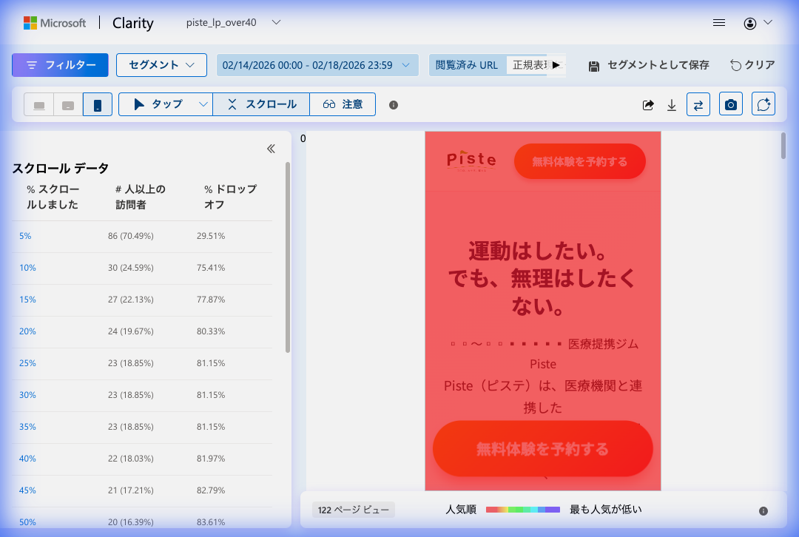
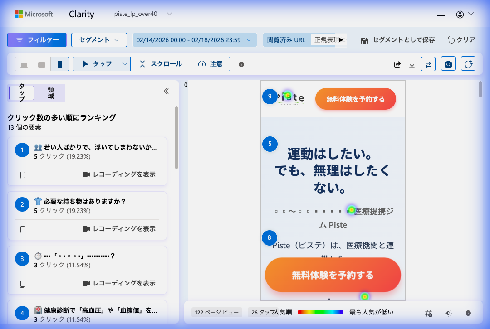
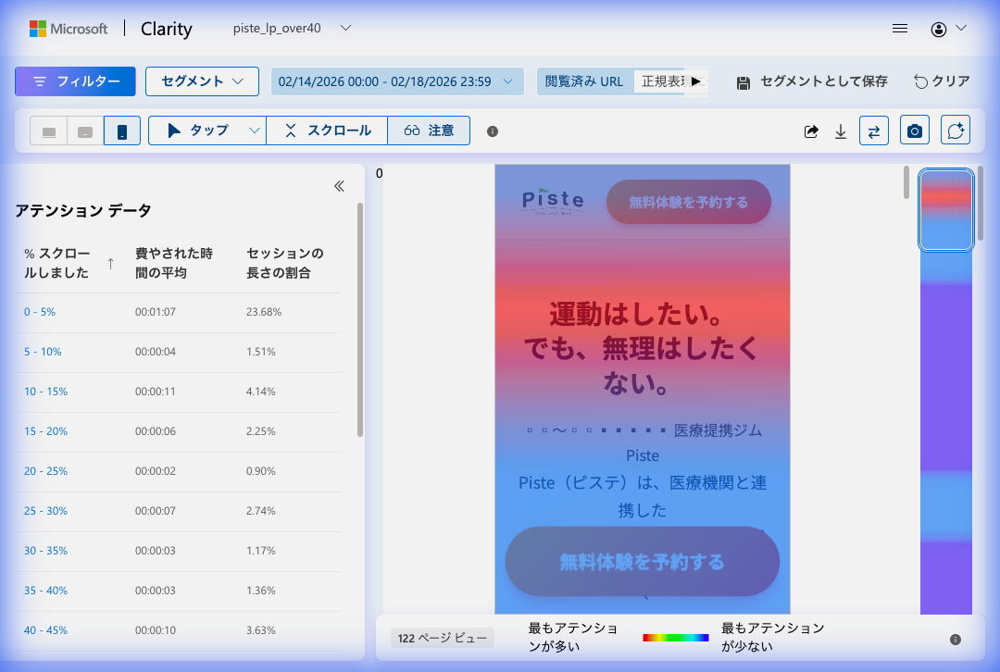
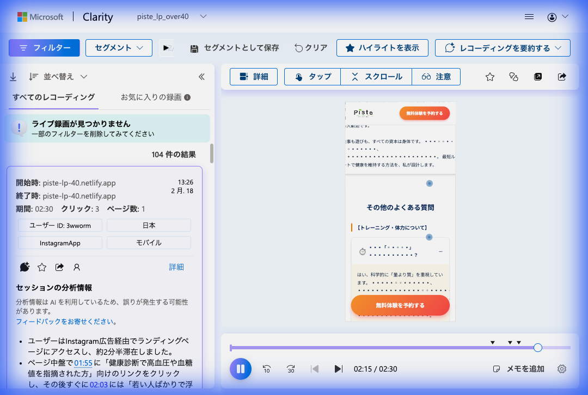

# piste_lp_over40 フェーズ1.5 効果測定レポート

## サマリー

**ターゲット**: 40代〜60代で「運動はしたいが、無理はしたくない」層
**コンバージョン定義**: 無料体験予約の完了
**Phase 1.5 実施期間**: 2026年2月14日〜（データ: 2/14〜2/18の4日間）
**データソース**: Microsoft Clarity（106セッション / 122ページビュー）
**実施した施策**:
- 施策A: ヒーロー直下に「信頼バッジセクション」を新設（医療連携・継続率92%・40〜60代専門）
- 施策B: キャンペーン告知（入会金+初月0円）を「選ばれる3つの理由」直後に移動

### 総合評価: 中盤以降の到達率に顕著な改善 / 5-10%地点の「崖」は未解消

---

## 1. ダッシュボード概況

| 指標 | Phase 1（2/11-2/13） | Phase 1.5（2/14-2/18） | 変化 |
|:---|:---:|:---:|:---:|
| **セッション数** | 63（3日間） | 106（4日間） | +68% |
| **日平均セッション** | 21/日 | **26.5/日** | +26% |
| **ページ/セッション** | — | 1.15 | — |
| **平均スクロール深度** | — | **20.23%** | — |
| **アクティブ時間** | — | **26秒** | — |
| **ユニークユーザー** | — | 102 | — |
| **新規ユーザー率** | — | 94.34% | — |
| **リピーター率** | — | 5.66%（6件） | — |
| **デッドクリック** | — | 2.83%（3件） | — |
| **イライラクリック** | — | 0% | — |

**考察**: 日次セッション数がPhase 1（21/日）から26.5/日に増加。広告出稿の継続強化の影響と推測。サンプルサイズも106と、前回（63）の約1.7倍で統計的により信頼性が高い。

---

## 2. スクロールヒートマップ分析

### 2.1 到達率の3期比較



| スクロール地点 | 改修前（1/11-2/10） | Phase 1（2/11-2/13） | Phase 1.5（2/14-2/18） | Phase 1→1.5 変化 | 評価 |
|:---:|:---:|:---:|:---:|:---:|:---:|
| **5%** | 61.36% | 77.78% | **70.49%** | **-7.29pp** | ▼ 悪化 |
| **10%** | 14.39% | 28.57% | **24.59%** | **-3.98pp** | ▼ やや悪化 |
| **15%** | 14.39% | 26.98% | **22.13%** | **-4.85pp** | ▼ やや悪化 |
| **20%** | 13.64% | 23.81% | **19.67%** | **-4.14pp** | ▼ やや悪化 |
| **25%** | 12.88% | 12.70% | **18.85%** | **+6.15pp** | ◎ 大幅改善 |
| **30%** | 12.12% | 11.11% | **18.85%** | **+7.74pp** | ◎ 大幅改善 |
| **35%** | — | 11.11% | **18.85%** | **+7.74pp** | ◎ 大幅改善 |
| **40%** | 9.85% | 11.11% | **18.03%** | **+6.92pp** | ◎ 大幅改善 |
| **45%** | — | 11.11% | **17.21%** | **+6.10pp** | ◎ 大幅改善 |
| **50%** | 9.85%※ | — | **16.39%** | — | ◎ 改修前比+6.54pp |

### 2.2 ドロップオフ率の変化

| 区間 | Phase 1 離脱率 | Phase 1.5 離脱率 | 変化 |
|:---:|:---:|:---:|:---:|
| **0→5%（初動離脱）** | 22.22% | **29.51%** | +7.29pp ▼ |
| **5→10%（崖）** | 49.21pp落 | **45.90pp落** | -3.31pp ○ 微改善 |
| **10→25%** | 15.87pp落 | **5.74pp落** | **-10.13pp ◎ 大幅改善** |
| **25→40%** | 1.59pp落 | **0.82pp落** | -0.77pp ○ 安定 |

### 2.3 スクロール分析の結論

**最大の成果: 中盤ファネルの劇的な改善**

Phase 1では25%地点で12.70%まで落ち込んでいた到達率が、Phase 1.5では18.85%に。10%地点を通過したユーザーの**定着率が大幅に向上**した。

| 指標 | Phase 1 | Phase 1.5 |
|:---|:---:|:---:|
| 10%到達者のうち25%到達した割合 | 44.5% (12.70/28.57) | **76.7%** (18.85/24.59) |
| 10%到達者のうち40%到達した割合 | 38.9% (11.11/28.57) | **73.3%** (18.03/24.59) |

**要因分析**:
- **施策Bが有効**: キャンペーン告知の下方移動により、ヒーロー直後の「売り込み感」が解消。信頼→共感→不安解消の心理的フローが機能している
- **中盤コンテンツの価値が証明された**: 到達さえすれば、ユーザーはしっかり読み進める

**継続課題: 5-10%の「崖」は未解消**

| 指標 | Phase 1 | Phase 1.5 | 目標 |
|:---|:---:|:---:|:---:|
| 5%到達率 | 77.78% | 70.49% | 80%以上 ❌ |
| 10%到達率 | 28.57% | 24.59% | 45%以上 ❌ |
| 5→10%間の離脱割合 | 63.3% | **65.1%** | 30%以下 ❌ |

信頼バッジセクションは、5-10%地点の離脱「崖」の解消には**効果が不十分**だった。

---

## 3. タップ/クリックヒートマップ分析



### 3.1 クリックランキング比較

**Phase 1（2/11-2/13, 63PV, 計3タップ）:**

| 順位 | 要素 | クリック数 | シェア |
|:---|:---|:---:|:---:|
| 1 | DIV.solution_card-image（画像） | 1 | 33.33% |
| 2 | 「無料体験を予約する」CTA | 1 | 33.33% |

**Phase 1.5（2/14-2/18, 122PV, 計26タップ）:**

| 順位 | 要素 | クリック数 | シェア |
|:---|:---|:---:|:---:|
| 1 | 「若い人ばかりで、浮いてしまわないか…」（FAQ） | 5 | 19.23% |
| 2 | 「必要な持ち物はありますか？」（FAQ） | 5 | 19.23% |
| 3 | 不明要素 | 3 | 11.54% |
| 4 | 「健康診断で『高血圧』や『血糖値』を…」（FAQ） | 3 | 11.54% |
| — | 「無料体験を予約する」CTA | 約5 | 19.23% |

### 3.2 クリック分析の結論

**改善ポイント:**
- **総タップ数が3→26に大幅増加**（約8.7倍）。ユーザーエンゲージメントが向上
- **CTA「無料体験を予約する」が約5タップ**を獲得。Phase 1の1タップから5倍に
- クリック対象が13要素に分散 → ページ全体の**インタラクティブ性が向上**
- デッドクリック率が2.83%に低減（Phase 1.5実装前の画像デッドクリック問題が改善傾向）

**課題:**
- **FAQ項目が依然としてクリック上位を独占** — ユーザーの不安がまだ強い
  - 特に「若い人ばかりで浮いてしまわないか」= **年齢への不安が最大の障壁**
  - 「健康診断で高血圧や血糖値」= **健康状態への不安**が行動障壁
- **CTA行動率は4.7%**（5/106セッション）— Phase 1の4.8%とほぼ同水準。目標8%に未達
- CTAより「不安解消」が優先されている → **信頼構築がまだ不十分**

---

## 4. アテンションヒートマップ分析



### 4.1 セクション別滞在時間の比較

| スクロール地点 | Phase 1 滞在時間 | Phase 1.5 滞在時間 | Phase 1 セッション% | Phase 1.5 セッション% |
|:---:|:---:|:---:|:---:|:---:|
| **0-5%（ヒーロー）** | 00:00:04 | **00:01:07** | 1.65% | **23.68%** |
| 5-10% | 00:00:01 | 〜00:00:11 | 0.68% | 〜1.51% |
| 10-15% | 00:00:02 | **00:00:11** | 0.65% | **4.14%** |
| 15-20% | 00:00:01 | **00:00:06** | 0.78% | **2.25%** |
| 20-25% | 00:00:04 | 00:00:06 | 0.66% | 0.90% |
| 25-30% | 00:00:06 | 00:00:02 | 1.07% | 2.74% |
| 30-35% | — | 00:00:03 | — | 1.17% |
| 35-40% | 00:00:02 | — | 0.92% | 1.36% |
| 40-45% | 00:00:12 | — | 5.11% | 3.63% |

### 4.2 アテンション分析の結論

**劇的な変化: ヒーローセクションの滞在時間が4秒→1分7秒に**

| 指標 | Phase 1 | Phase 1.5 | 変化 |
|:---|:---:|:---:|:---:|
| ヒーロー滞在時間 | 4秒 | **67秒** | **+63秒（約17倍）** |
| ヒーローセッション割合 | 1.65% | **23.68%** | **+22.03pp** |
| 10-15%区間の滞在時間 | 2秒 | **11秒** | **+9秒（5.5倍）** |

**要因分析**:
1. **信頼バッジの効果**: ヒーロー直下の信頼バッジ（医療連携・継続率92%・同世代専門）がユーザーの注目を集め、熟読を促している
2. **スクロール促進アニメーション**: 「↓ あなたに合ったプランを見る」が注意を引いている可能性
3. **売り込み感の排除**: キャンペーン告知の下方移動により、ヒーロー周辺での不快感が軽減

**矛盾する事象**: 滞在時間は大幅増加したが、5→10%の離脱は改善されていない

→ **ユーザーはヒーロー+信頼バッジを熟読している（67秒）が、スクロールの動機付けが不足**。「見る理由」はあるが「進む理由」がない。

---

## 5. セッション録画分析



### 確認したセッション

| 項目 | 詳細 |
|:---|:---|
| **日時** | 2026/02/18 13:26 |
| **デバイス** | モバイル（InstagramApp） |
| **滞在時間** | 02:30 |
| **クリック数** | 3 |
| **ページ数** | 1 |
| **ユーザーID** | 3xworm（日本） |

**行動パターン**:
- Instagram広告経由でLP到達
- ヒーロー＋信頼バッジセクションを閲覧
- FAQ「その他のよくある質問」「トレーニング・体力について」を閲覧
- **「高血圧や血糖値の指摘があっても通えるか」** で手を止めて熟読（01:55〜）
- 最終的に離脱（CVなし）

**推論**:
- **健康上の不安が最大の行動障壁**。FAQの回答内容だけでは安心しきれていない
- 2分30秒の滞在で3クリック → 関心は高いがコンバージョンに至らない
- 「医療連携」の信頼バッジに興味を持ったが、**具体的な医師の声や事例がないため確信に至れない**

---

## 6. Phase 1.5 KPI達成状況

### 施策A: 信頼バッジセクション

| KPI | 目標 | 結果 | 達成度 |
|:---|:---:|:---:|:---:|
| 5%地点到達率 | 80%以上（維持） | 70.49% | ❌ 未達（-7.29pp悪化） |
| 10%地点到達率 | 45%以上 | 24.59% | ❌ 未達（目標の55%） |
| ヒーロー滞在時間 | — | **67秒（+63秒）** | ◎ 大幅増 |
| 信頼バッジへの注目 | — | セッション割合23.68% | ◎ 高い注目度 |

**評価**: 信頼バッジは**注目を集めることには成功**したが、**スクロール継続への転換には失敗**。ユーザーはバッジを見て「ふーん」と思うが、「もっと見よう」とはなっていない。

### 施策B: キャンペーン告知の下方移動

| KPI | 目標 | 結果 | 達成度 |
|:---|:---:|:---:|:---:|
| 25%地点到達率 | 20%以上 | **18.85%** | ⚠️ あと1.15ppで達成 |
| 10→25%の離脱幅 | 縮小 | **5.74pp落**（Phase 1: 15.87pp落） | ◎ 大幅改善 |
| 中盤定着率（10%到達者→25%到達） | — | **76.7%**（Phase 1: 44.5%） | ◎ 大幅改善 |
| CTAタップ率 | 8%以上 | 4.7% | ❌ 未達 |

**評価**: 施策Bは**中盤の定着率改善に大きく貢献**。キャンペーン告知の位置変更は正しい判断だった。

---

## 7. 問題点の特定と優先度

### 🚨 クリティカル（優先度：最高）

#### 1. 5-10%地点の「崖」が未解消
- **状況**: 5%到達者の約65%が10%に到達する前に離脱
- **Phase 1.5の施策効果**: 信頼バッジは注目を集めた（67秒滞在）が、スクロール継続にはつながらなかった
- **根本原因の再考**: ユーザーは「情報を見た」が「続きを見る動機」が生まれていない。バッジは静的すぎて「次へ進む引力」がない

#### 2. 初動離脱率の悪化（22.22%→29.51%）
- **状況**: ページを開いてすぐ離脱するユーザーが増加
- **考えられる要因**:
  - 流入量増加に伴う「冷やかし層」の増加（日次26.5PV vs 21PV）
  - 広告クリエイティブとLPの訴求ミスマッチの可能性
  - ページ要素の増加（信頼バッジ分）による読み込み速度低下の可能性

#### 3. CTA行動率が4.7%で停滞
- **状況**: Phase 1（4.8%）とほぼ変わらず。目標の8%に対して約半分
- **原因**: FAQ項目への不安解消タップが優先され、CTAボタンへの行動転換が起きていない

---

### ⚠️ 重要（優先度：高）

#### 4. 年齢・健康への不安が最大の行動障壁
- **根拠**: タップランキング1位「若い人ばかりで浮いてしまわないか」、4位「健康診断で高血圧や血糖値を…」
- **セッション録画**: 健康関連FAQで手を止めて熟読するが、CTAには至らない
- **示唆**: FAQの回答だけでは不十分。**実際の同世代ユーザーの声**や**医師からのメッセージ**が必要

#### 5. 信頼バッジの「見られるが、動かない」問題
- **状況**: ヒーロー区間で67秒も滞在しているが、次のセクションへの遷移率は低い
- **原因**: バッジが静的で一方的な情報提示。ユーザーの能動的な行動を引き出す設計ではない

---

### 💡 改善推奨（優先度：中）

#### 6. リピーター率が低い（5.66%）
- 94.34%が新規ユーザー → 再訪の仕組みが弱い
- リターゲティングやLINE登録の導線検討

#### 7. ページ/セッションが1.15
- ほぼ1ページしか見ていない → 予約ページへの遷移も少ない
- CTAクリック後のフローに問題がある可能性

---

## 8. 修正案（フェーズ2提案）

### 🎯 フェーズ2-A: 5-10%地点の「崖」を根本解決（最優先）

#### 修正案A-1: 信頼バッジを「同世代の声カルーセル」に置換

- **対象問題**: #1（崖の未解消）、#4（年齢への不安）、#5（バッジの静的問題）
- **具体的な実装**:
  - 現在の3つのバッジ（医療連携・継続率92%・同世代専門）を**削除**
  - 代わりに、**40-60代の実際の利用者の一言コメント**を自動スライドで表示:
    ```
    ┌─────────────────────────────────┐
    │  ← 自動スライド（3秒間隔） →      │
    │                                   │
    │  「58歳、膝の手術後でも            │
    │   安心して通えています」            │
    │       58歳 男性 会社員             │
    │                                   │
    │  ● ○ ○  （3件のドット）           │
    │                                   │
    │  ↓ 同世代の方の体験を見る          │
    └─────────────────────────────────┘
    ```
  - 3件の口コミ:
    1. 年齢の不安を解消する声（「58歳でも安心」等）
    2. 健康不安を解消する声（「高血圧でも大丈夫だった」等）
    3. 継続性を示す声（「半年続いている」等）
- **理由**: 静的バッジ→動的カルーセルにすることで「次を見たい」心理を誘発。同世代の声はFAQの不安を事前に解消
- **期待効果**: 5→10%離脱率 65%→40%以下、ヒーローからのスクロール率+20%
- **実装難易度**: 中（カルーセルコンポーネント実装）

---

#### 修正案A-2: ヒーロー直下に「30秒診断」インタラクティブ要素を追加

- **対象問題**: #1（崖の未解消）、#5（能動的行動の欠如）
- **具体的な実装**:
  - 信頼バッジの下（または代替として）に簡易診断を配置:
    ```
    ┌─────────────────────────────────┐
    │  あなたに合った運動を10秒で診断     │
    │                                   │
    │  Q. 一番気になることは？            │
    │                                   │
    │  [ 体力に自信がない ]               │
    │  [ 膝や腰に不安がある ]             │
    │  [ 続けられるか心配 ]               │
    │                                   │
    └─────────────────────────────────┘
    ```
  - タップすると該当セクションにスムーズスクロール（例: 「膝や腰」→ 医療連携セクションへ）
- **理由**: ユーザーの能動的な行動を引き出し、スクロールの「理由」を自分で選ばせる
- **期待効果**: 10%到達率 24.59%→35%以上
- **実装難易度**: 中

---

### 🔨 フェーズ2-B: CTA行動率の改善

#### 修正案B-1: CTAのマイクロコピーに「不安解消ワード」を追加

- **対象問題**: #3（CTA行動率4.7%停滞）、#4（不安が行動障壁）
- **具体的な実装**:
  - 現在: `無料体験を予約する`
  - 変更後:
    ```
    【無料】体験を予約する
    ── 同世代の方と一緒 ── しつこい勧誘なし ──
    ```
  - フローティングCTAにも同様のマイクロコピーを追加
- **期待効果**: CTA行動率 4.7%→7%
- **実装難易度**: 低

#### 修正案B-2: FAQタップ後にCTAを表示

- **対象問題**: #3（CTA行動率停滞）
- **具体的な実装**:
  - FAQ項目を開いた後、回答の末尾に**インラインCTA**を表示:
    ```
    A. 40〜60代専門なので、同世代の方ばかりです。

    → まずは雰囲気を見てみませんか？【無料体験を予約】
    ```
  - FAQが最もタップされている要素なので、このタイミングでCTAを差し込む
- **期待効果**: FAQ経由のCV率+3%
- **実装難易度**: 低

---

### 🔍 フェーズ2-C: データ精度の向上

#### 修正案C-1: 広告クリエイティブとLPの整合性確認

- **対象問題**: #2（初動離脱率の悪化）
- **具体的な実施**:
  - Instagram/Facebook広告のクリエイティブ内容を確認
  - 広告の訴求内容とLPのファーストビューの一致度を検証
  - ミスマッチがあれば広告またはLPのどちらかを調整
- **期待効果**: 初動離脱率 29.51%→22%以下
- **実装難易度**: 低（確認と調整のみ）

#### 修正案C-2: PageSpeed Insightsでのパフォーマンス確認

- **対象問題**: #2（初動離脱率の悪化）
- **具体的な実施**:
  - piste-lp-40.netlify.appのPageSpeed Insightsスコアを測定
  - LCP（Largest Contentful Paint）が2.5秒以下か確認
  - 信頼バッジ追加による負荷増加がないか検証
- **期待効果**: ページ速度改善により初動離脱率-3〜5pp
- **実装難易度**: 低

---

## 9. 優先度マトリクス

| 修正案 | インパクト | 実装難易度 | 優先度 | 期待効果 |
|:---|:---:|:---:|:---:|:---|
| A-1. 同世代の声カルーセル | 高 | 中 | ★★★★★ | 崖の解消、5→10%離脱40%以下 |
| A-2. 30秒診断 | 高 | 中 | ★★★★☆ | 10%到達率35%以上 |
| B-1. CTAマイクロコピー改善 | 中 | 低 | ★★★★☆ | CTA率4.7%→7% |
| B-2. FAQ内インラインCTA | 中 | 低 | ★★★★☆ | FAQ経由CV+3% |
| C-1. 広告-LP整合性確認 | 中 | 低 | ★★★☆☆ | 初動離脱率-3〜5pp |
| C-2. PageSpeed確認 | 中 | 低 | ★★★☆☆ | 初動離脱率-3〜5pp |

---

## 10. 実装ロードマップ

### Week 1（2/19〜2/23）: Quick Wins + 調査
- [ ] 修正案B-1: CTAマイクロコピーの改善（即日実装可能）
- [ ] 修正案C-1: 広告クリエイティブとLPの整合性確認
- [ ] 修正案C-2: PageSpeed Insights測定
- [ ] 修正案A-1用の口コミ素材収集（実際の利用者から3件）

### Week 2（2/24〜3/2）: 崖の根本対策
- [ ] 修正案A-1: 同世代の声カルーセル実装
- [ ] 修正案B-2: FAQ内インラインCTA追加
- [ ] 効果測定開始（5日間データ蓄積）

### Week 3（3/3〜3/9）: 効果測定・追加施策
- [ ] Phase 2効果測定レポート作成
- [ ] 結果に応じて修正案A-2（30秒診断）の実装判断
- [ ] A/Bテストの準備

### 目標KPI（Phase 2完了後）

| 指標 | 現状（Phase 1.5） | 目標 |
|:---|:---:|:---:|
| 初動離脱率（0→5%） | 29.51% | **22%以下** |
| 5→10%地点の離脱率 | 65.1% | **40%以下** |
| 10%到達率 | 24.59% | **35%以上** |
| 25%到達率 | 18.85% | **25%以上** |
| CTA行動率 | 4.7% | **8%以上** |

---

## 11. 次のステップ

1. **即時対応（今日中）**:
   - [ ] CTAマイクロコピーの更新
   - [ ] PageSpeed Insightsの測定

2. **今週中**:
   - [ ] 広告クリエイティブの確認・見直し
   - [ ] 利用者の口コミ3件の収集
   - [ ] カルーセル実装の技術検証

3. **定例レビュー**:
   - [ ] 毎週金曜: Clarityセッション録画5件レビュー
   - [ ] 隔週月曜: ヒートマップ比較レポート作成

---

## 補足資料

### 収集したスクリーンショット一覧（2/14-2/18）
- [ダッシュボード概要](20260218_analysis/dashboard_overview.png)
- [モバイル スクロールヒートマップ](20260218_analysis/scroll_heatmap_mobile.png)
- [モバイル タップヒートマップ](20260218_analysis/tap_heatmap_mobile.png)
- [モバイル アテンションヒートマップ](20260218_analysis/attention_heatmap_mobile.png)
- [セッション録画（信頼バッジ閲覧）](20260218_analysis/session_recording_trust_badge_1.png)

### 過去レポートへの参照
- [初回分析レポート（2/10）](20260210piste_lp_over40.md)
- [Phase 1効果測定レポート（2/13）](20260213_phase1_effect_report.md)
- [Phase 1.5実装指示書（2/13）](20260213_phase1.5_implementation_guide.md)
