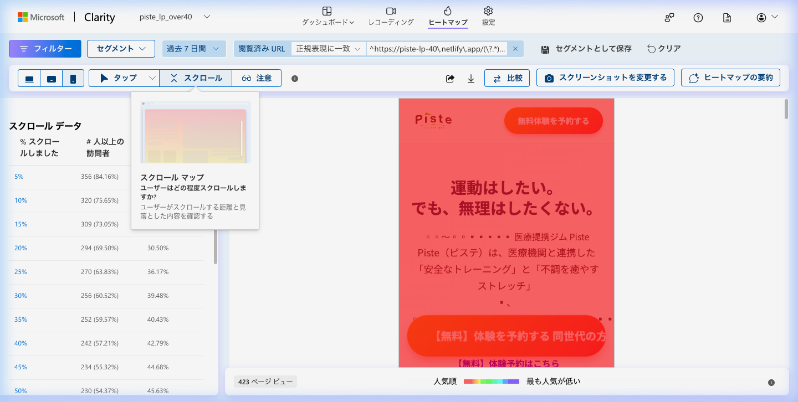
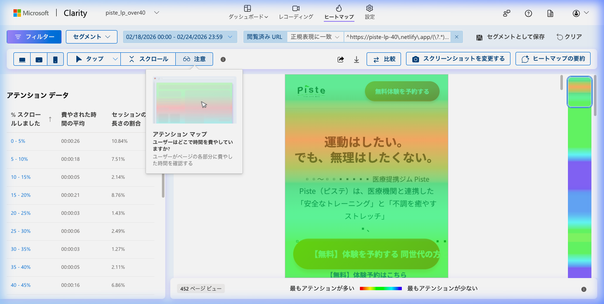
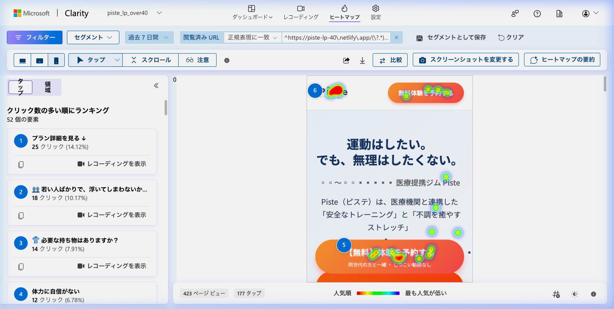
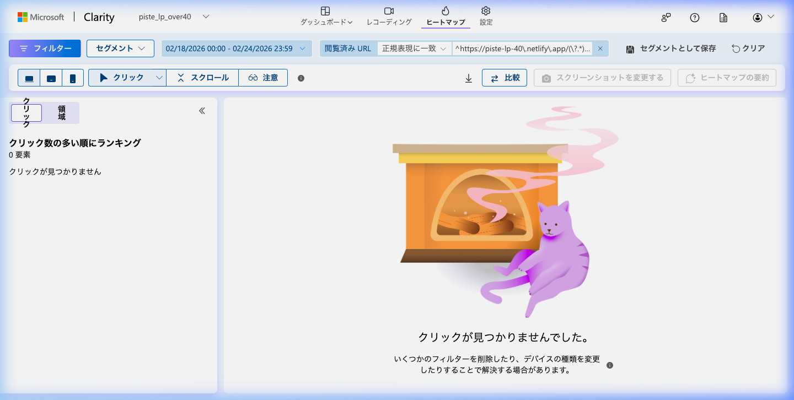

# piste_over40 Clarityデータ — 2026-02-25

## 分析期間
2026-02-18 〜 2026-02-24

## 基本指標
- セッション数: 423
- ページビュー数: 約448（セッション別ページ数 1.06ベース）
- 平均滞在時間: 59秒
- 直帰率: 0.52%（クイックバック率）
- デバイス比率（モバイル/デスクトップ）: モバイル 98.35% / デスクトップ 1.65%

## スクロールヒートマップ
- 25%到達率: 算出不明（50%時点で54.37%のため、それ以上と推測）
- 50%到達率: 54.37%
- 75%到達率: 算出不明
- 100%到達率: 16.78%
- 主要離脱ポイント: 50%スクロール付近からアテンションが急激に低下し、離脱が進行
- スクリーンショット: 

## アテンションヒートマップ
- 最も注目されているセクション: 冒頭の0-10%圏内（メインビジュアル・キャッチコピー付近。平均滞在時間約20秒以上）
- 注目度が低いセクション: ページ中盤以降のコンテンツ（プラン詳細やFAQなどへのスクロール・滞在が少ない）
- スクリーンショット: 

## クリックヒートマップ
### モバイル
- 最もクリックされている要素: 「プラン詳細を見る ↓」（全体の14.12% / 25クリック）、「若い人ばかりで、浮いてしまわないか…」（FAQ / 18クリック）
- デッドクリック: 6.38%（リンクではないヘッダーテキスト等へのタップが見られる）
- スクリーンショット: 

### デスクトップ
- 最もクリックされている要素: ※期間中のデストップトラフィックが極めて少数のため（全体の1.65%）、有意なクリックデータ観測ゼロ
- デッドクリック: 有意なデータなし
- スクリーンショット: 

## セッション録画の知見
### セッション1
- デバイス: モバイル (Instagram App)
- 滞在時間: 00:33
- 行動パターン: ページ全体を中速でスクロール。途中で料金や目次ボタンの付近を1回クリック。
- 離脱ポイント: コンテンツ後半の料金表付近で離脱。

### セッション2
- デバイス: モバイル (Instagram App)
- 滞在時間: 00:07
- 行動パターン: ファーストビューの確認のみ。スクロールは行わず。
- 離脱ポイント: 冒頭のメインビジュアルで即座に離脱。

### セッション3
- デバイス: モバイル (Instagram App)
- 滞在時間: 08:43
- 行動パターン: スクロールやクリックなどの操作はないが、長時間滞在。内容を精読しているかタブを開いたまま別作業をしている可能性あり。
- 離脱ポイント: 冒頭〜中盤付近。
