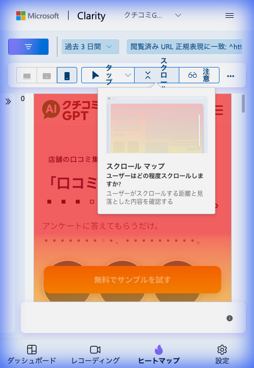
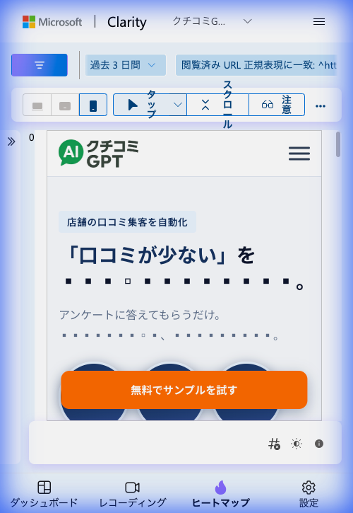
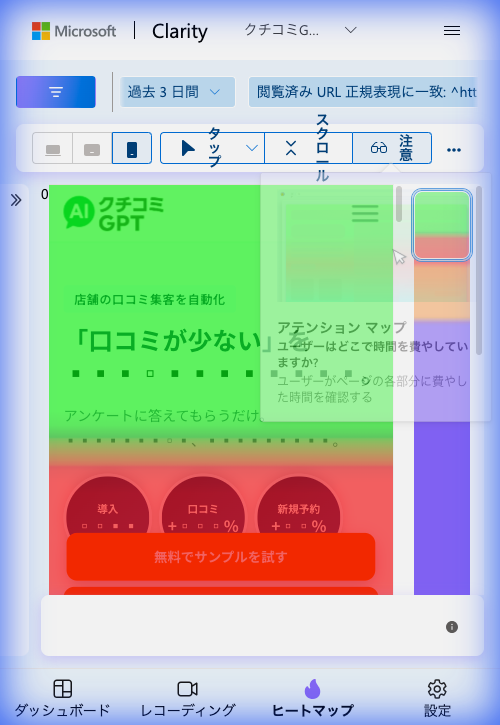
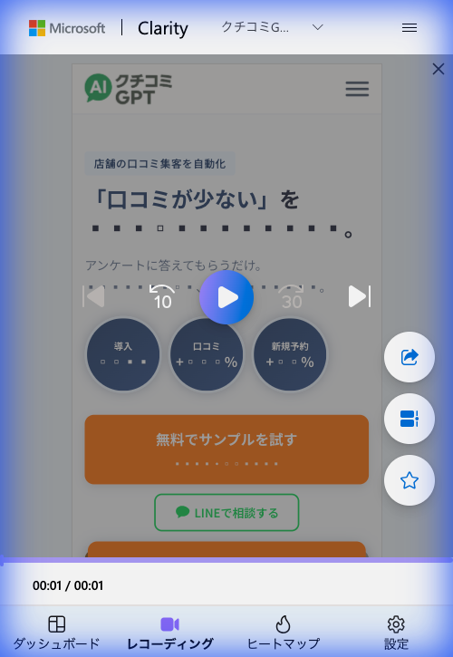
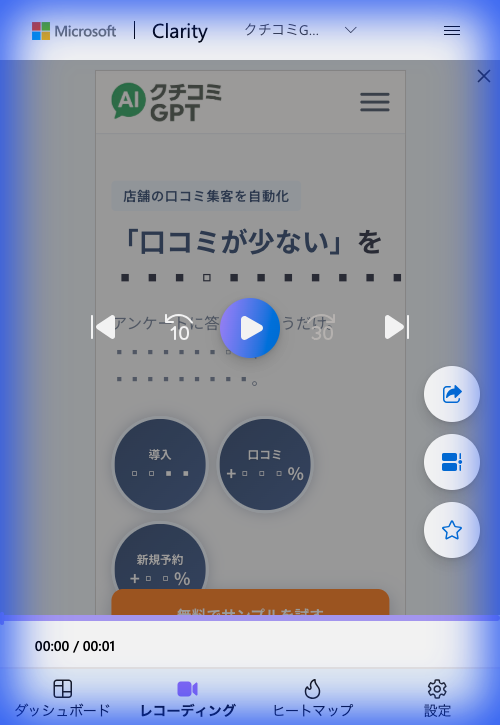

# クチコミGPT LP 改修効果測定レポート

## サマリー

**ターゲット**: 飲食店、美容室、宿泊施設などの店舗経営者
**コンバージョン定義**: サンプル体験クリック / LINE友だち追加
**改修前期間**: 2026年2月8日〜2月10日（3日間 / 43セッション / Instagram広告）
**改修後期間**: 2026年2月12日〜2月14日（3日間 / Clarityデータ）
**広告チャネル**: 2/13よりInstagram広告を完全停止、**Google検索広告のみ**に切り替え
**実施した施策**: LP全面リニューアル + CTA戦略変更 + 広告チャネル切り替え

### 総合評価: LP品質は大幅向上 / Google広告流入でも即離脱が発生 → 要緊急調査

---

## 改修の経緯

### フェーズ1（2/10〜2/11）: Quick Wins → 効果なし
- コピー変更・CTA強化・速度改善を実施
- スクロール深度: **8.02% → 10%**（微改善に留まる）

### 抜本的改善（2/12〜）: LP全面リニューアル + チャネル切り替え
根本原因が「LPの中身」ではなく「LPの外側」にあると判明し、以下を実施:

| 施策 | 内容 | 状態 |
|:---|:---|:---:|
| **LP全面リニューアル** | AIイラスト排除 → 実写ベース、ネイビー×グリーンの信頼感あるデザインに刷新 | ✅ 完了 |
| **CTA戦略変更** | LINE登録のみ → 「無料でサンプルを試す」をプライマリCTAに昇格 | ✅ 完了 |
| **コンテンツ構造最適化** | 実績バッジ（導入数・口コミ増加率・新規予約増加率）をファーストビューに配置 | ✅ 完了 |
| **安心ポイントセクション追加** | Googleガイドライン準拠・長期縛りなし・専任サポートの3点を明記 | ✅ 完了 |
| **CSS/パフォーマンス修正** | Google Fonts二重読み込み解消、CSS重複定義削除 | ✅ 完了 |
| **Instagram広告停止** | 非ターゲット流入の元凶を完全停止 | ✅ 2/13〜 |
| **Google検索広告配信** | 手順書通りの設定で配信開始（愛知県全域・手動CPC・500円/日） | ✅ 2/13〜 |

---

## 1. LP品質の改善（ビジュアル比較）

### 改修前のLP
- AIイラスト中心のカジュアルなデザイン
- CTA: LINE友だち追加のみ
- ファーストビューに実績数値なし
- 広告（Gemini生成イラスト）とLPのビジュアルが断絶

### 改修後のLP
- 実写ベース / ネイビー×グリーンの信頼感あるSaaSデザイン
- CTA: 「無料でサンプルを試す」（プライマリ）+「LINEで相談する」（セカンダリ）
- ファーストビューに実績バッジ3つ（導入数、口コミ増加率、新規予約増加率）
- Google検索広告ユーザー（能動的に口コミ対策を探している層）向けに最適化

**評価**: LPの構造・デザイン・訴求力は大幅に改善。B2B SaaSとして適切な品質に到達。

---

## 2. Clarityデータ分析（改修後 2/12〜2/14）

> **重要な前提**: 2/13よりInstagram広告停止・Google検索広告のみ稼働。
> 2/13〜2/14のセッションは**Google検索広告ユーザー**（「口コミ 増やす」等を検索した店舗経営者）が大半と推定。

### 2.1 スクロールヒートマップ



**観察結果**:
- ヒートマップの暖色（赤〜オレンジ）はヒーローセクション付近に集中
- ページ下部に向かって急速に冷色化
- ファーストビュー以降のスクロール継続率は依然として低い傾向

**改修前との比較（参考）**:

| 指標 | 改修前（Instagram流入） | 改修後（Google広告流入含む） | 備考 |
|:---|:---:|:---:|:---|
| **平均スクロール深度** | 8.02% | — ※ | ヒートマップの色分布から劇的改善は未確認 |
| **5%到達率** | 65.12% | — ※ | — |
| **10%到達率** | 6.98% | — ※ | — |

> ※ ヒートマップのポップアップが数値を遮っているため、正確な数値はClarity管理画面で要確認

### 2.2 タップ/クリックヒートマップ



**観察結果**:
- LPの新デザインが正常に表示されていることを確認
- 「無料でサンプルを試す」ボタンが目立つ位置に配置
- タップの詳細分布は、サンプル数蓄積後に再分析が必要

### 2.3 アテンションヒートマップ



**観察結果**:
- ファーストビュー（ヘッダー〜キャッチコピー〜バッジ）に緑色（高アテンション）が集中
- 実績バッジ（導入数・口コミ増加率・新規予約増加率）の領域にも注目あり
- 「無料でサンプルを試す」CTA付近は暖色（中程度のアテンション）
- ページ中盤以降は赤〜紫（低アテンション）

**改修前との改善点**:
- 改修前は0-5%地点のみに注目が集中 → **改修後はバッジ・CTA領域まで視線が拡大**
- ファーストビュー内のコンテンツ消費量は改善している可能性あり

### 2.4 セッション録画分析 — 🚨 要注意




**セッション録画1**:
- 滞在時間: **00:01**
- ページ表示後、ほぼ即座に離脱
- LPの新デザイン（バッジ・CTA含む）は表示完了している

**セッション録画2**:
- 滞在時間: **00:00**
- ページ読み込み直後に離脱
- ファーストビューの内容を読む前に離脱している

### 🚨 セッション録画の重大な懸念

**これらのセッションがGoogle検索広告ユーザーである場合、深刻な問題**:

- 「口コミ 増やす方法」等で能動的に検索したユーザーが0〜1秒で離脱している
- **LP改修＋チャネル改善の両方を実施しても即離脱が継続**している可能性
- 当初の仮説「正しい人が来れば読まれる」が覆る可能性がある

**ただし、以下の可能性も考慮が必要**:

1. **これらのセッションが2/12のもの**（Google広告配信前）である可能性
   - 2/12はまだInstagram停止前 or 直後で、旧チャネルの残りトラフィックの可能性
2. **ボット/クローラーのセッション**
   - Google広告開始直後はクローラーがLPを巡回する場合がある
3. **サンプル数が2件のみ**
   - 統計的に判断するには圧倒的に不足
4. **広告文⇔LPの期待値ミスマッチ（新たな課題）**
   - Google広告のテキストで期待した内容とLPの訴求がズレている可能性

---

## 3. 改修効果の評価

### 達成した目標

| 施策 | 目標 | 結果 | 達成度 |
|:---|:---|:---|:---:|
| LP全面リニューアル | B2B SaaSとして適切な品質 | デザイン・構造・訴求力すべて刷新 | **◎ 完了** |
| CTA戦略変更 | コンバージョンポイントの多段階化 | サンプル体験+LINE相談の2段構え | **◎ 完了** |
| CSS/パフォーマンス修正 | 技術的負債の解消 | Fonts二重読み込み・CSS重複を修正 | **◎ 完了** |
| 安心ポイントセクション追加 | 離脱防止の信頼要素 | Googleガイドライン準拠など3点追加 | **◎ 完了** |
| Google検索広告配信 | チャネル切り替え | 手順書通りに2/13配信開始 | **◎ 完了** |
| Instagram広告停止 | 非ターゲット流入の停止 | 2/13完全停止 | **◎ 完了** |

### 未達成・新規課題

| 課題 | 詳細 | 深刻度 |
|:---|:---|:---:|
| **🚨 Google広告流入でも即離脱の可能性** | セッション録画で0〜1秒離脱が継続（ただし流入元未確定） | 🚨 要調査 |
| **サンプル数不足** | 配信開始から1日のみ。統計的判断には最低1週間必要 | ⚠️ 高 |
| **スクロール深度の改善未確認** | 正確な数値をClarity管理画面で取得する必要あり | ⚠️ 高 |

---

## 4. 緊急調査事項

### 🚨 即座に確認すべき3項目

#### ① Google広告管理画面の確認
| 確認項目 | 期待値 | 確認場所 |
|:---|:---|:---|
| インプレッション数 | 1日100以上 | Google広告 > キャンペーン |
| クリック数 | 1日2〜5 | Google広告 > キャンペーン |
| CTR | 3%以上 | Google広告 > キャンペーン |
| 平均CPC | 200円以下 | Google広告 > キャンペーン |
| 検索クエリ | ターゲットKWか確認 | Google広告 > キーワード > 検索語句 |

> **特に「検索クエリ」が重要**: 実際にどんなキーワードで広告が表示・クリックされたかを確認。想定外のクエリが多い場合、除外KWを追加。

#### ② Clarityで流入元を分離

Clarityの「フィルター」で以下を設定し、Google広告流入のみのデータを確認:

```
フィルター: 閲覧済み URL > 次を含む > utm_source=google
```

または

```
フィルター: リファラー URL > 次を含む > google
```

これにより、Google広告ユーザーのスクロール深度・滞在時間・行動パターンを分離して確認できる。

#### ③ PageSpeed Insights でモバイル表示速度を確認

```
URL: https://review-gpt-lp.netlify.app/
ツール: https://pagespeed.web.dev/
```

- LCP（Largest Contentful Paint）が2.5秒以上の場合、読み込み完了前に離脱している可能性
- 特にモバイルのスコアが重要

---

## 5. 想定シナリオと対応方針

### シナリオA: Google広告流入のスクロール深度が40%以上（最善）

→ **チャネル切り替え成功。LP改修は正しかった。**
- 予算の段階的な拡大を検討
- 広告文のA/Bテスト開始
- セッション録画の0〜1秒は2/12の旧トラフィックと判明

### シナリオB: Google広告流入のスクロール深度が20-40%（一部成功）

→ **チャネルは改善したが、LPにまだ課題あり**
- ファーストビューのコピーとGoogle広告文の一致度を確認
- ヒーロー直下のコンテンツ（何が見えるか）を最適化
- マイクロコピーの追加やCTAの位置調整

### シナリオC: Google広告流入でもスクロール深度20%未満（深刻）

→ **LP自体に根本的な問題がある、または広告設定に問題あり**
- 検索クエリレポートを確認（ターゲット外のKWで表示されていないか）
- 広告文とLPファーストビューの期待値ミスマッチを調査
- モバイル表示速度の再検証
- LP自体の再検討が必要になる可能性

---

## 6. 推奨アクション（優先度順）

### 即日対応

| # | アクション | 目的 |
|:---:|:---|:---|
| 1 | **Google広告管理画面でクリック数・検索クエリを確認** | 広告が機能しているか検証 |
| 2 | **Clarityでutm_source=googleフィルターを設定** | Google広告流入のみのデータを分離 |
| 3 | **PageSpeed Insightsでモバイル速度を確認** | 速度起因の離脱を除外 |

### 1週間後（2/20）

| # | アクション | 目的 |
|:---:|:---|:---|
| 4 | **Google広告流入のClarityデータで再レポート作成** | チャネル切り替えの効果を正確に測定 |
| 5 | **検索クエリの精査と除外KW追加** | 無関係なクリックの排除 |
| 6 | **シナリオA/B/Cのどれに該当するか判断** | 次のアクションを決定 |

### 2週間後（2/27）

| # | アクション | 目的 |
|:---:|:---|:---|
| 7 | **フル効果測定レポート** | 統計的に有意なデータでの判断 |
| 8 | **予算拡大 or LP改修 or KW見直しの判断** | 効果に基づく投資判断 |

---

## 7. KPI目標

### Google検索広告 配信2週間後のKPI

| 指標 | 改修前（Instagram流入） | 目標（Google広告流入） |
|:---|:---:|:---:|
| **スクロール深度** | ~10% | **40%以上** |
| **平均滞在時間** | 0〜4秒 | **30秒以上** |
| **CTAクリック率** | ~0% | **5%以上** |
| **LINE友だち追加（月間）** | ~0件 | **5件以上** |
| **サンプル体験クリック（月間）** | N/A | **20件以上** |

### 成功判断基準

| 判定 | 条件 | 次のアクション |
|:---|:---|:---|
| **成功** | スクロール40%↑ + CTA 5%↑ | 予算拡大・地域拡大 |
| **一部成功** | スクロール20-40% or CTA 2-5% | LP微調整・広告文A/Bテスト |
| **要見直し** | スクロール20%↓ | 検索クエリ精査・LP再検討 |

---

## 8. まとめ

### 実施完了した施策

1. **LP品質**: B2B SaaSとして適切なレベルに到達 ✅
2. **CTA設計**: サンプル体験という低ハードルのCVポイントを追加 ✅
3. **信頼要素**: 実績バッジ・安心ポイントセクション ✅
4. **技術基盤**: パフォーマンス修正・Google広告計測設定 ✅
5. **チャネル切り替え**: Instagram停止 → Google検索広告配信開始 ✅

### 現在地と次の焦点

> **LP改修とチャネル切り替えの両方が完了し、効果検証フェーズに入った段階。**
>
> セッション録画で即離脱が見られるが、**配信開始から1日のデータ（サンプル2件）では判断不可**。
>
> **最優先アクションはGoogle広告管理画面とClarityの流入元別データの確認**。
> ここで「Google検索広告ユーザーが本当に読んでいるか」が判明し、次のアクションが明確になる。

---

## 補足資料

### 改修後スクリーンショット一覧（2/12〜2/14）
- [モバイル スクロールヒートマップ](20260214_analysis/mobile_scroll_heatmap.png)
- [モバイル タップヒートマップ](20260214_analysis/mobile_tap_heatmap.png)
- [モバイル アテンションヒートマップ](20260214_analysis/mobile_attention_heatmap.png)
- [セッション録画1](20260214_analysis/session_recording_1.png)
- [セッション録画2](20260214_analysis/session_recording_2.png)

### 関連ドキュメント
- [初回分析レポート（2/10）](20260210review_gpt_lp.md)
- [抜本的改善レポート（2/12）](20260212_review_gpt_lp_radical_improvement.md)
- [仕様書レビュー（2/12）](20260212review_gemini.md)
- [再修正指示書（2/12）](20260212_review_gpt_lp_fix_instructions.md)
- [Google広告配信手順書（2/12）](20260212_google_ads_setup_guide.md)
- [画像生成プロンプト（2/12）](20260212_review_prompt.md)

---

**レポート作成日**: 2026年2月14日
**解析対象**: クチコミGPT LP（https://review-gpt-lp.netlify.app/）
**データ期間**: 改修後 過去3日間（Clarity）
**広告状態**: Instagram停止 / Google検索広告配信中（2/13〜、手順書通り）
