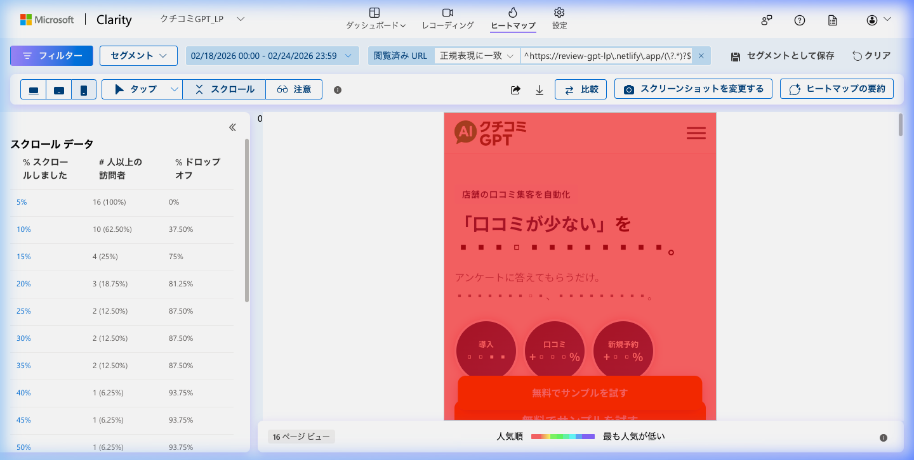
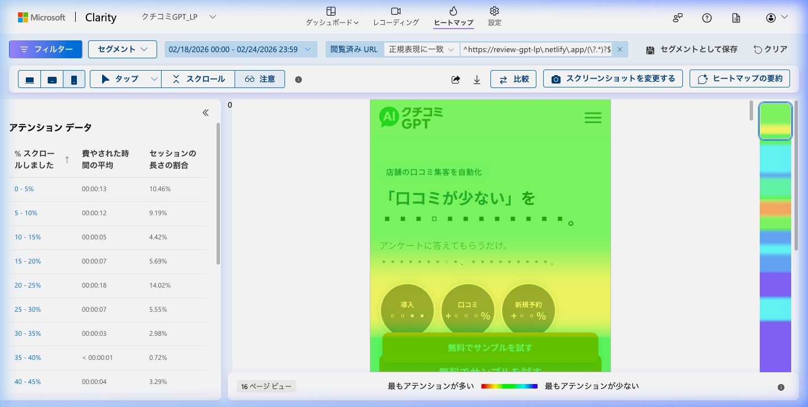
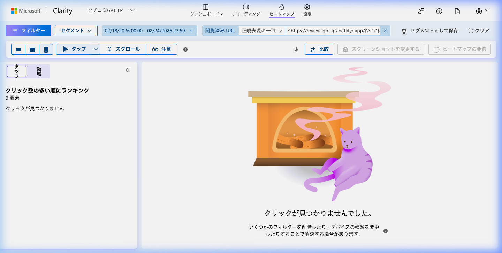
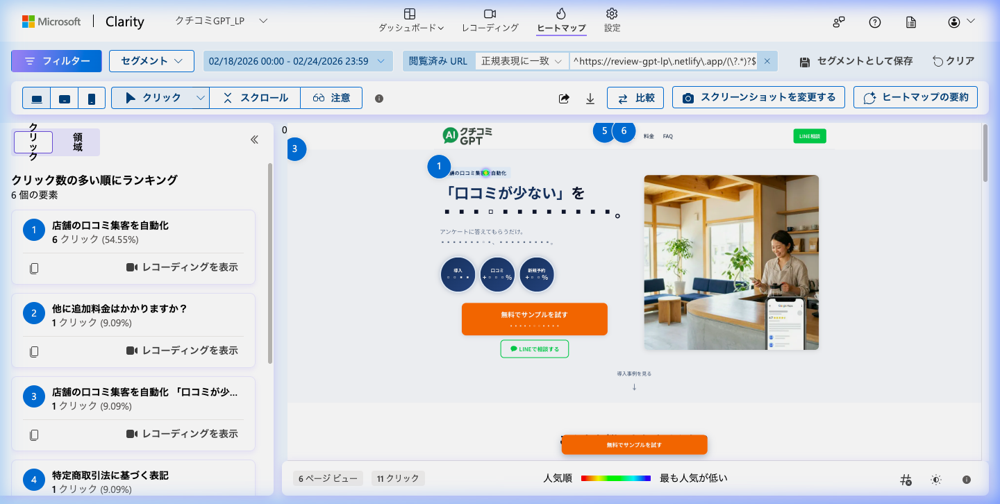

# review_gpt Clarityデータ — 2026-02-25

## 分析期間
2026-02-18 〜 2026-02-24

## 基本指標
- セッション数: 27（ボット・除外トラフィックを除く）
- ページビュー数: 27
- 平均滞在時間: 30秒（アクティブ時間：約8秒）
- 直帰率: 0%（クイックバック率）
- デバイス比率（モバイル/デスクトップ）: モバイル 89% / デスクトップ 11%

## スクロールヒートマップ
- 25%到達率: 12.50%
- 50%到達率: 6.25%
- 75%到達率: 算出不能（ほぼ0%）
- 100%到達率: 算出不能（ほぼ0%）
- 主要離脱ポイント: ファーストビューの直後（10%から15%にかけて到達者が激減し、多くがトップエリアで離脱している）
- スクリーンショット: 

## アテンションヒートマップ
- 最も注目されているセクション: 特殊なファーストビュー領域（0-10%の範囲・平均滞在時間21〜27秒と極端に長いが、読み込まれた直後に止まっているケースが大半）
- 注目度が低いセクション: 25%以降のコンテンツ全体（ほとんどスクロールされていないため、滞在時間が5秒未満）
- スクリーンショット: 

## クリックヒートマップ
### モバイル
- 最もクリックされている要素: `#menu-toggle`（メニューアイコン・28.57%）、FV内ボタン付近（28.57%）
- デッドクリック: 7.41%周辺（クリック対象ではないテキストへの誤タップなど）
- スクリーンショット: 

### デスクトップ
- 最もクリックされている要素: トラフィック自体が非常に少なく（期間中3セッション程度）、統計的に有意な特定要素へのクリック集中は見られず（全体で11クリックのみ散見）。
- デッドクリック: 特筆事項なし
- スクリーンショット: 

## セッション録画の知見
### セッション1
- デバイス: モバイル (Chrome)
- 滞在時間: 00:16
- 行動パターン: 少しだけスクロールし、最上部ヒーローエリアの要素に2回タップ操作をしたのみ。
- 離脱ポイント: 冒頭のセクショントップ付近。

### セッション2
- デバイス: モバイル (Safari)
- 滞在時間: 00:01
- 行動パターン: ページの読み込み直後、内容を確認する間もなく即時にバウンス（直帰）。
- 離脱ポイント: ページ読み込み時点のファーストビュー。

### セッション3
- デバイス: モバイル (Google App)
- 滞在時間: 00:02
- 行動パターン: 外部サイト（ure.pia.co.jp）のリファラルリンク経由でアクセスしたが、スクロール等一切行わず即離脱。
- 離脱ポイント: ページ読み込み時点のファーストビュー。
